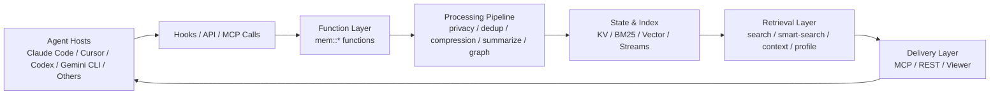
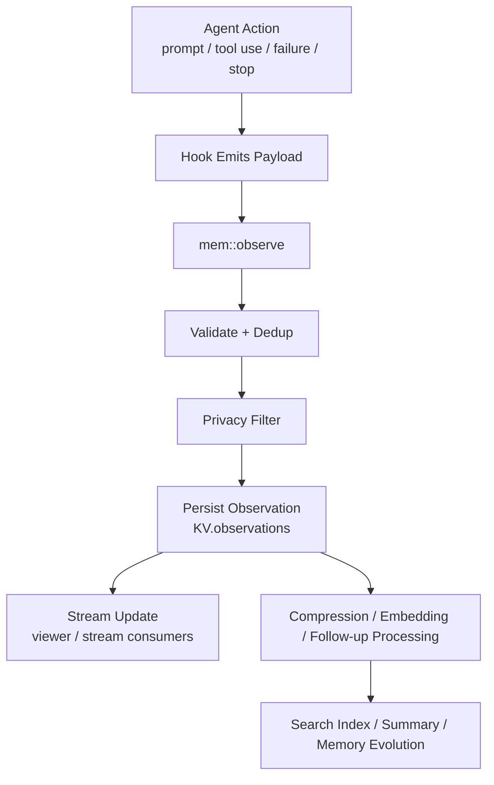
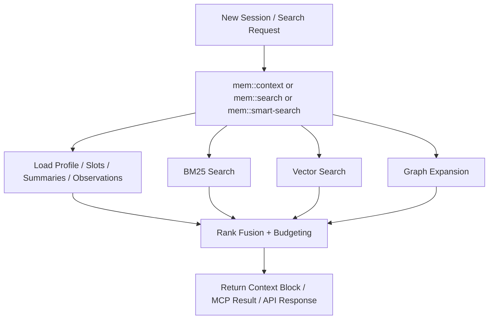

# agentmemory 架构说明

本文面向新接手 `agentmemory` 的开发者，重点回答三个问题：

1. 这个系统的核心职责是什么。
2. 它由哪些层组成，各层如何协作。
3. 一次记忆写入与一次记忆召回，分别经过哪些关键路径。

这是一份理解型文档，不是接口参考手册。阅读完之后，你应该能够快速建立对 `agentmemory` 的整体认知，并知道从哪里进入源码。

## 1. 设计目标

`agentmemory` 是一个为 AI 编码代理提供长期记忆能力的后台服务。它要解决的问题不是“再多写一点规则文件”，而是让代理在跨会话、跨工具、跨宿主时，仍然能够记住过去发生过的事。

更具体地说，它解决的是以下几类问题：

- 会话结束后上下文丢失，代理每次都要重新理解项目。
- 关键决策、文件位置、工作模式、常见错误无法沉淀为长期知识。
- 不同代理宿主各自维护记忆，导致上下文割裂。
- 把全部历史塞回 prompt 的成本太高，也不适合上下文窗口。

因此，`agentmemory` 的目标不是保存“全文历史”，而是建立一套可持续积累、可检索、可裁剪、可共享的记忆系统。

## 2. 系统全景

从整体上看，`agentmemory` 可以分成五层：

- 采集层：通过 hooks 和显式调用收集代理行为。
- 处理层：对原始 observation 做去重、脱敏、压缩、摘要和抽取。
- 记忆层：把结果存入状态存储，并维护不同粒度的记忆对象。
- 检索层：用 BM25、向量检索和图关系召回相关上下文。
- 接口层：通过 MCP、REST 和 viewer 把能力暴露给不同宿主。

这张图表达的是一个闭环：

- 代理行为先被采集为 observation。
- observation 进入处理流程，转化为更适合长期存储和检索的结构。
- 结构化结果进入状态存储与索引。
- 后续检索请求从存储和索引中召回相关信息。
- 召回结果再通过 MCP、REST 或注入上下文回到代理。

## 3. 架构核心思想

### 3.1 用 iii-engine 做统一运行时

这个项目不是在 Node 进程里手写一套 Web 服务、队列、调度器和存储层，而是建立在 `iii-engine` 的三类基础原语之上：

- Function：系统核心能力的执行单元。
- Trigger：HTTP、事件、生命周期等触发入口。
- State：持久化状态和索引承载。

在代码上，统一入口位于 `src/index.ts`。这里完成了几件关键事情：

- 初始化 provider、embedding provider、KV、索引和指标。
- 注册大量 `mem::*` 函数，例如观察、压缩、搜索、总结、上下文生成。
- 注册 REST trigger 和 MCP endpoint。
- 启动 viewer、健康检查、自动遗忘与自动整合定时任务。

也就是说，`src/index.ts` 不是业务实现本身，而是整个系统的组装点。

### 3.2 记忆不是单一对象，而是一条流水线

这个系统并不把“记忆”理解成一条简单字符串，而是把它看成从原始行为到长期知识的演化过程：

- 原始行为先以 observation 的形式捕获。
- observation 被压缩成更适合索引和召回的结构。
- 多个 observation 可以被总结成 session summary。
- 更高层的事实、模式、流程和关系会在后续处理中形成长期记忆。

这也是为什么源码里会同时存在 observation、summary、profile、memory、graph、slot 等不同对象。它们不是重复建模，而是在不同层次承载不同目的。

## 4. 核心分层

### 4.1 采集层

采集层负责回答一个问题：代理刚刚做了什么。

主要来源有两类：

- 生命周期 hooks，例如 `SessionStart`、`UserPromptSubmit`、`PreToolUse`、`PostToolUse`、`Stop`。
- 显式的函数调用或 API 调用，例如 `mem::remember`、`mem::search`、`mem::context`。

相关代码入口：

- `src/hooks/`：宿主侧 hook 脚本。
- `src/functions/observe.ts`：核心 observation 写入逻辑。
- `src/triggers/api.ts`：REST 层入口。
- `src/mcp/server.ts`：MCP 工具调用入口。

采集层的特点不是“信息全”，而是“尽量自动”。系统希望在不要求用户额外维护笔记的前提下，持续收集行为证据。

### 4.2 处理层

处理层负责把原始 observation 变成可长期使用的结构化内容。

它的典型操作包括：

- 去重：避免短时间内重复写入相同工具调用。
- 脱敏：剥离私密信息和敏感内容。
- 压缩：把原始输入输出转成事实、叙述、概念等更紧凑的结构。
- 摘要：把会话层面的行为收束成 summary。
- 图抽取：在开启相关功能时抽取实体和关系。

在 `src/functions/observe.ts` 中可以看到一个典型流程：

- 校验 payload。
- 计算去重哈希并跳过重复 observation。
- 调用隐私过滤逻辑清洗原始数据。
- 将原始 observation 写入 `KV.observations(sessionId)`。
- 将 observation 推送到 stream，供 viewer 和其他消费方实时观察。
- 按配置触发后续压缩、视觉 embedding 等异步处理。

这一层决定了“系统最终记住什么样的内容”。

### 4.3 记忆层

记忆层负责持久化和组织数据。

这里至少包含几类核心对象：

- Session：一次代理会话的元信息。
- Observation：原始或压缩后的行为记录。
- Summary：会话层级的摘要。
- Memory：显式保存或抽取得到的长期记忆。
- Profile：项目级画像，例如概念、关键文件、约定和常见错误。
- Slot：可固定注入的记忆槽位。

底层状态访问由 `StateKV` 封装，作用域定义在 `src/state/schema.ts`。这意味着系统不是把所有内容塞进一张表，而是用多个有语义的 KV scope 来承载不同对象类型。

### 4.4 检索层

检索层负责回答另一个问题：现在最值得拿回来的上下文是什么。

它不是简单全文搜索，而是混合检索：

- BM25：处理关键词、文件名、术语。
- Vector：处理语义相似问题。
- Graph：处理实体关系和关联扩散。

这部分的核心装配发生在 `src/index.ts` 中：

- `SearchIndex` 维护 BM25 索引。
- `VectorIndex` 维护向量索引。
- `HybridSearch` 负责融合多个检索信号。
- `registerSmartSearchFunction()` 将混合检索能力注册为系统函数。

在 `src/functions/search.ts` 中可以看到两个关键职责：

- 索引构建和重建。
- 对 observation 和 memory 的统一搜索入口。

这层的关键价值在于：它不要求把全部历史重新放入上下文，而是只召回当前任务最相关的一小部分。

### 4.5 接口层

接口层负责把内部能力暴露给外部代理和用户。

主要形式有三种：

- MCP：给支持 MCP 的代理提供工具化接口。
- REST：给不走 MCP 的宿主或脚本提供 HTTP 调用方式。
- Viewer：提供实时观察、回放和状态查看界面。

相关入口分别是：

- `src/mcp/server.ts`
- `src/triggers/api.ts`
- `src/viewer/server.ts`

接口层的设计目标是宿主无关。也就是说，`agentmemory` 不依赖某一个代理平台私有能力，而是把“记忆”包装成任何宿主都能消费的独立服务。

## 5. 写入路径：一次记忆如何进入系统

下面这张图描述的是从一次代理行为到 observation 入库和索引更新的大致过程。

可以按下面的顺序理解：

1. 代理生命周期事件或工具调用通过 hook 形成 payload。
2. `mem::observe` 校验输入并生成 observation ID。
3. 系统根据 session、tool name 和输入内容做短窗口去重。
4. 原始数据在写入前先经过隐私过滤。
5. 清洗后的 observation 被写入状态存储。
6. 写入后通过 stream 向 viewer 和其他订阅方广播。
7. 后续流程根据配置执行压缩、embedding、图抽取、summary 等处理。

这个路径里最重要的设计点有两个：

- 先保存原始 observation，再做后续增强处理，保证主路径稳健。
- 允许部分增强能力软失败，例如 embedding 失败不应阻断基础写入。

## 6. 读取路径：一次召回如何发生

下面这张图描述的是一个新会话或搜索请求如何从历史中提取最相关上下文。

读取路径的核心不是“查到尽可能多”，而是“在预算内返回最有价值的部分”。

例如在 `src/functions/context.ts` 中，`mem::context` 会优先组织这些内容：

- pinned slots
- project profile
- 历史 session summary
- 重要 observation

然后它会做两件事：

- 按时间和重要性组织候选 block。
- 在 token budget 内选择可返回内容。

这说明 `context` 不是通用搜索 API，而是面向“会话启动时如何组织可注入上下文”的专用路径。

## 7. 运行时主链路

如果你要从源码理解系统装配，建议从 `src/index.ts` 开始。

它的主线可以概括为：

1. 读取配置，创建 LLM provider 与 embedding provider。
2. 初始化 `StateKV`、向量索引、BM25 索引和指标设施。
3. 注册各类 `mem::*` 函数，包括 observation、compression、search、context、summary、graph、team、governance 等。
4. 构造 `HybridSearch`，把 BM25、向量和图信号组装到统一召回层。
5. 注册 REST trigger、事件 trigger 和 MCP endpoints。
6. 启动 viewer、健康监控与自动化定时任务。
7. 从持久化存储恢复索引，必要时重建索引。

这个入口体现出一个重要事实：

- `agentmemory` 不是“只有搜索”的系统。
- 它是一个长期运行的 worker，负责采集、处理、存储、检索和对外服务的完整闭环。

## 8. 关键模块对照

下表适合作为第一次读代码时的导航：

| 路径 | 角色 | 关注点 |
| --- | --- | --- |
| `src/index.ts` | 运行时装配入口 | 系统如何启动、注册和连线 |
| `src/hooks/` | 宿主侧生命周期捕获 | 代理行为从哪里进入系统 |
| `src/functions/observe.ts` | observation 写入入口 | 去重、脱敏、落盘、stream 广播 |
| `src/functions/search.ts` | 搜索与索引入口 | BM25 重建、向量写入、搜索主路径 |
| `src/functions/context.ts` | 上下文组装入口 | 如何按预算组织可注入上下文 |
| `src/functions/summarize.ts` | 会话总结 | 会话层语义提炼 |
| `src/functions/remember.ts` | 显式长期记忆写入 | 手工保存决策、事实、模式 |
| `src/functions/graph.ts` | 图抽取与查询 | 实体关系建模 |
| `src/state/kv.ts` | 状态访问封装 | 如何读写 iii-engine 状态 |
| `src/state/schema.ts` | 状态命名与作用域 | 系统持久化对象如何分布 |
| `src/state/search-index.ts` | BM25 索引 | 关键词召回 |
| `src/state/vector-index.ts` | 向量索引 | 语义召回 |
| `src/state/hybrid-search.ts` | 混合检索协调 | 多路召回如何融合 |
| `src/triggers/api.ts` | REST 入口 | 对外 HTTP 接口如何挂载 |
| `src/mcp/tools-registry.ts` | MCP 工具定义 | 对外暴露了哪些能力 |
| `src/mcp/server.ts` | MCP 调用分发 | 工具请求如何落到 `mem::*` 函数 |
| `src/viewer/` | 可视化界面 | 运行时观测、回放、状态展示 |

## 9. 架构特点与权衡

### 9.1 优点

- 自动采集优先，降低用户维护成本。
- 内部以函数和状态为中心，扩展路径统一。
- 检索是混合式而非单通道，兼顾精确命中和语义召回。
- 上下文返回按预算裁剪，更适合真实代理使用场景。
- MCP、REST、viewer 三种出口让系统不绑定单一宿主。

### 9.2 代价

- 系统不是单文件工具，而是一个持续运行的服务，理解成本较高。
- 数据对象层次较多，初读时容易把 observation、summary、memory 混在一起。
- 某些高级能力依赖 embedding 或 LLM provider，运行效果受配置影响。
- 索引、图关系、自动整合等能力让系统更强，但也提升了调试复杂度。

理解这些权衡后，再看代码里的模块拆分就会更自然：它们不是过度设计，而是在承接不同阶段的数据形态和系统责任。

## 10. 新人建议的阅读顺序

如果你是第一次进入这个仓库，建议按下面顺序阅读：

1. 先读 `README.md` 中的 “Why” 和 “How It Works”，理解产品目标。
2. 再读 `src/index.ts`，建立运行时装配的全局视角。
3. 接着读 `src/functions/observe.ts`，理解写入主路径。
4. 然后读 `src/functions/search.ts` 和 `src/functions/context.ts`，理解召回主路径。
5. 再看 `src/triggers/api.ts` 和 `src/mcp/server.ts`，理解对外接口。
6. 最后按兴趣深入 `summary`、`graph`、`slots`、`team`、`snapshot` 等增强模块。

## 11. 一句话总结

`agentmemory` 的本质，是在代理和项目之间加入一个长期记忆层：

- 它自动观察代理做过什么。
- 它把这些行为逐步转成更稳定的知识。
- 它在下一次任务到来时，只把最相关的部分返还给代理。

如果把整个系统再压缩成一句工程化表述，那么它就是：

> 一个基于 iii-engine primitives 构建的、面向 AI 编码代理的持久化记忆运行时。
