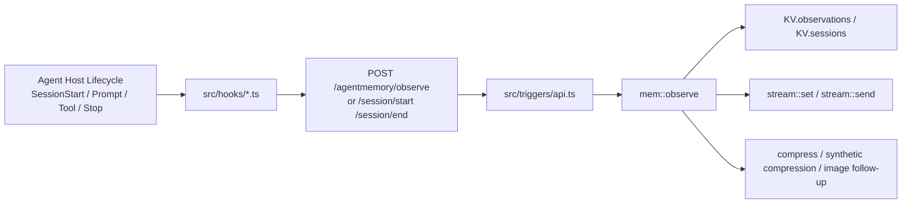
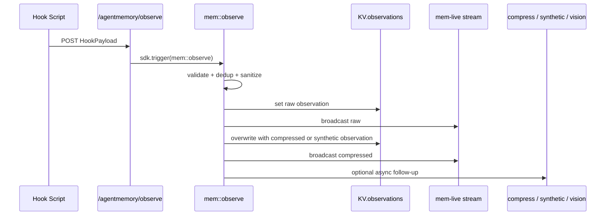

# agentmemory 采集层实现细节

本文是一份采集层参考文档，面向第一次接手 `agentmemory` 的开发者。

它重点回答下面几个问题：

1. 采集层在整个系统里负责什么。
2. hook 事件是如何进入服务端的。
3. `mem::observe` 如何把 payload 转成 observation。
4. 采集路径上有哪些边界条件、降级策略和扩展点。

本文只覆盖采集层实现细节，不展开检索层、总结层、图谱层和 viewer 的完整实现。

## 1. 采集层职责

采集层的职责是把“代理刚刚做了什么”转成系统可消费的输入。

在 `agentmemory` 中，这一层不直接解决召回，也不负责最终长期记忆的组织方式。它的核心目标只有三个：

- 尽可能自动地捕获代理生命周期中的关键行为。
- 以统一 payload 形式把行为送入服务端。
- 在不阻塞宿主代理的前提下，把行为落成 observation，并触发后续处理。

因此，采集层既是系统的入口，也是后续压缩、索引、总结和记忆演化的起点。

## 2. 总体结构

采集层可以拆成两段：

- 客户端侧 hook 脚本：运行在代理宿主生命周期里，负责把事件转成 HTTP 请求。
- 服务端 observation 写入逻辑：接收 payload，完成校验、去重、脱敏、落盘和后续触发。



从职责上看：

- `src/hooks/*.ts` 负责接住宿主事件。
- `src/triggers/api.ts` 负责把 HTTP 请求映射到内部函数。
- `src/functions/observe.ts` 负责 observation 的核心写入路径。

## 3. 入口清单

### 3.1 hook 脚本目录

采集层的宿主侧入口主要位于 `src/hooks/`。这些脚本是独立的 Node.js 程序，通过 `stdin` 读取宿主传入的 JSON，再调用本地 REST API。

当前与 observation 直接相关的 hook 包括：

| 文件 | 发送的 hookType | 主要用途 |
| --- | --- | --- |
| `src/hooks/session-start.ts` | 不直接发 `observe`，调用 `/session/start` | 注册 session，并按配置获取可注入上下文 |
| `src/hooks/prompt-submit.ts` | `prompt_submit` | 记录用户 prompt |
| `src/hooks/pre-tool-use.ts` | 默认不写 observation | 按需调用 `/enrich` 做前置上下文注入 |
| `src/hooks/post-tool-use.ts` | `post_tool_use` | 记录成功工具调用 |
| `src/hooks/post-tool-failure.ts` | `post_tool_failure` | 记录失败工具调用 |
| `src/hooks/subagent-start.ts` | `subagent_start` | 记录子代理启动 |
| `src/hooks/subagent-stop.ts` | `subagent_stop` | 记录子代理结束 |
| `src/hooks/notification.ts` | `notification` | 记录通知事件 |
| `src/hooks/task-completed.ts` | `task_completed` | 记录任务完成事件 |
| `src/hooks/stop.ts` | 不直接发 `observe`，调用 `/summarize` | 触发会话总结 |
| `src/hooks/session-end.ts` | 不直接发 `observe`，调用 `/session/end` | 标记 session 完成，并触发可选整理流程 |

这里有一个重要区分：

- 有些 hook 直接进入 `/agentmemory/observe`，用于生成 observation。
- 有些 hook 负责 session 生命周期管理，或者负责在边界点触发总结和整合。

### 3.2 服务端入口

服务端采集层主要有两个入口：

- `POST /agentmemory/session/start`
- `POST /agentmemory/observe`

其中：

- `/agentmemory/session/start` 负责创建 `Session` 记录，并返回上下文。
- `/agentmemory/observe` 负责接收标准 `HookPayload`，再转发给 `mem::observe`。

## 4. 数据模型

### 4.1 HookPayload

采集层统一使用 `HookPayload` 作为服务端 observation 入口的输入模型。

```ts
export interface HookPayload {
  hookType: HookType;
  sessionId: string;
  project: string;
  cwd: string;
  timestamp: string;
  data: unknown;
}
```

这个结构体现出采集层的几个设计选择：

- `hookType` 标识当前事件类别。
- `sessionId` 作为 observation 的归属单位。
- `project` 和 `cwd` 为后续项目级画像和过滤提供上下文。
- `data` 不做过早强约束，以适配不同 hook 负载。

### 4.2 RawObservation

`mem::observe` 首先构造的是 `RawObservation`。

```ts
export interface RawObservation {
  id: string;
  sessionId: string;
  timestamp: string;
  hookType: HookType;
  toolName?: string;
  toolInput?: unknown;
  toolOutput?: unknown;
  userPrompt?: string;
  assistantResponse?: string;
  raw: unknown;
  modality?: "text" | "image" | "mixed";
  imageData?: string;
}
```

这里要注意两点：

- `raw` 保存的是清洗后的原始数据，不是未经处理的输入。
- `toolName`、`toolInput`、`toolOutput`、`userPrompt` 是从 `data` 中按 hook 类型提取出来的便捷字段，便于后续压缩和检索使用。

### 4.3 状态作用域

采集层主要涉及以下状态 scope：

| KV scope | 作用 |
| --- | --- |
| `KV.sessions` | 保存 session 元信息 |
| `KV.observations(sessionId)` | 保存某个 session 下的 observation |
| `KV.imageRefs` | 图片引用计数 |
| `STREAM.name` + `STREAM.group(sessionId)` | session 维度实时流 |
| `STREAM.name` + `STREAM.viewerGroup` | viewer 全局实时流 |

这说明采集层写入的不仅是“数据”，还包括实时广播能力。

## 5. Hook 生命周期与行为

### 5.1 `session-start.ts`

`session-start.ts` 不是简单发一个 observation，而是会调用 `/agentmemory/session/start`。

它的职责有两个：

- 注册一个新的 session。
- 当 `AGENTMEMORY_INJECT_CONTEXT=true` 时，把服务端返回的上下文写到 stdout，供宿主代理注入第一轮对话。

这个 hook 有两个显著特点：

- 在默认配置下，它优先保证“会话被注册”，而不是强制上下文注入。
- 当不需要读取响应时，它使用短超时并且不等待完成，降低对宿主启动路径的影响。

### 5.2 `prompt-submit.ts`

`prompt-submit.ts` 负责记录用户 prompt。它会将事件包装为：

- `hookType: "prompt_submit"`
- `data: { prompt: data.prompt }`

这类事件通常用于：

- 记录会话的首个 prompt。
- 为后续 summary 和 context 组织提供用户意图线索。

### 5.3 `pre-tool-use.ts`

`pre-tool-use.ts` 是一个需要特别注意的边界 hook。

它默认不会写 observation，也默认不做任何工作。只有在 `AGENTMEMORY_INJECT_CONTEXT=true` 时才会启用，并且只针对文件相关工具：

- `Edit`
- `Write`
- `Read`
- `Glob`
- `Grep`

其作用不是记录行为，而是调用 `/agentmemory/enrich`，把相关文件和搜索词对应的上下文写回 stdout，注入到模型下一轮输入中。

因此：

- 它属于采集层附近的“前置增强”能力。
- 它不是 observation 写入主链路的一部分。

### 5.4 `post-tool-use.ts`

`post-tool-use.ts` 是采集层最关键的 hook 之一。

它会：

- 从宿主输入中读取 `tool_name`、`tool_input`、`tool_output`。
- 对 `tool_output` 做截断。
- 尝试提取 base64 图片数据。
- 将图片字段从可见输出中替换成占位文本。
- 调用 `/agentmemory/observe`，发送 `hookType: "post_tool_use"`。

这个 hook 的输出结构大致是：

```json
{
  "hookType": "post_tool_use",
  "sessionId": "...",
  "project": "...",
  "cwd": "...",
  "timestamp": "...",
  "data": {
    "tool_name": "...",
    "tool_input": {},
    "tool_output": "...",
    "image_data": "..."
  }
}
```

### 5.5 `post-tool-failure.ts`

`post-tool-failure.ts` 负责记录失败工具调用。

它会：

- 忽略中断类事件 `is_interrupt`。
- 截断 `tool_input` 和 `error` 字段。
- 将事件作为 `hookType: "post_tool_failure"` 发给 `/agentmemory/observe`。

这使得系统不仅能记住成功路径，也能记住失败上下文和错误模式。

### 5.6 `subagent-start.ts` 与 `subagent-stop.ts`

这两个 hook 用于记录子代理生命周期。

它们的 payload 重点字段包括：

- `agent_id`
- `agent_type`
- `last_message`，仅在 `subagent_stop` 中出现

这类 observation 的价值主要在于：

- 帮助恢复复杂任务中的多代理协作上下文。
- 为后续 summary 提供代理级活动线索。

### 5.7 `stop.ts` 与 `session-end.ts`

这两个 hook 不直接写 observation，但都属于采集层边界。

`stop.ts` 负责：

- 调用 `/agentmemory/summarize`
- 在会话结束时触发 best-effort 总结

`session-end.ts` 负责：

- 调用 `/agentmemory/session/end`
- 在启用相关配置时触发 crystals 自动整理、consolidate pipeline 和 Claude bridge sync

所以可以把它们视为：

- 采集层的结束信号
- 采集层向总结层和整合层的交接点

## 6. 服务端接收路径

### 6.1 `/agentmemory/session/start`

`src/triggers/api.ts` 中的 `api::session::start` 负责：

1. 校验 `sessionId`、`project`、`cwd`。
2. 创建 `Session` 对象并写入 `KV.sessions`。
3. 调用 `mem::context` 生成会话启动上下文。
4. 返回 `{ session, context }`。

也就是说，session 注册和上下文获取是一个组合动作。

### 6.2 `/agentmemory/observe`

`api::observe` 的职责非常单一：

1. 校验 `hookType`、`sessionId`、`project`、`cwd`、`timestamp`。
2. 组装 `HookPayload`。
3. 调用 `mem::observe`。
4. 返回 `201` 和 observation 结果。

这意味着真正的采集核心不在 HTTP 层，而在 `mem::observe`。

## 7. `mem::observe` 主链路

`src/functions/observe.ts` 是采集层的核心实现。

下面这张图描述了它的主要处理路径。



下面按处理阶段展开说明。

### 7.1 输入校验

`mem::observe` 首先校验最小必需字段：

- `sessionId`
- `hookType`
- `timestamp`

如果这些字段缺失或类型不对，函数直接返回错误结果，而不是尝试兜底推断。

### 7.2 observation ID 生成

通过 `generateId("obs")` 生成 observation ID。

这个 ID 的作用有三类：

- 作为 KV 中的 observation 键。
- 作为 stream item 标识。
- 作为后续压缩、embedding 和索引引用的统一标识。

### 7.3 去重

如果配置了 `DedupMap`，系统会根据以下信息计算哈希：

- `sessionId`
- 工具名或 hook 类型
- `tool_input`

若命中短时间窗口内重复内容，则直接返回：

```json
{ "deduplicated": true, "sessionId": "..." }
```

这里的设计重点是：

- 去重发生在真正落盘前。
- 去重以“近期重复行为”为目标，而不是长期全局唯一。

### 7.4 隐私过滤

`payload.data` 会先被 JSON 序列化，然后交给 `stripPrivateData()` 处理。

若 JSON 序列化失败，则退化为字符串清洗。

这一步的结果会进入 `raw` 字段，因此：

- observation 保存的是清洗后的数据。
- 下游压缩、summary、索引看到的也是清洗后的内容。

### 7.5 字段提取

在构造 `RawObservation` 时，系统会按 hook 类型提取若干便捷字段。

例如：

- `post_tool_use` / `post_tool_failure`
  - `toolName`
  - `toolInput`
  - `toolOutput`
- `prompt_submit`
  - `userPrompt`

这样做的价值在于：

- 保留原始 `raw`
- 同时为后续处理提供标准化访问入口

### 7.6 图片与模态识别

`extractImage()` 会尝试从字符串或对象中递归找到图片数据来源，支持：

- `data:image/...`
- 常见 base64 头
- `image_data`
- `image_path`
- `imageBase64`
- `imagePath`

如果发现图片：

- 仅有图片时，`modality = "image"`
- 图片和文本同时存在时，`modality = "mixed"`

如果图片是 base64 数据，还会：

- 落盘到本地图片存储
- 把 `raw.imageData` 替换为文件路径
- 更新 `KV.imageRefs`
- 触发磁盘使用量统计
- 在启用 `AGENTMEMORY_IMAGE_EMBEDDINGS=true` 时异步触发 `mem::vision-embed`

### 7.7 串行写入与 session 限额

`withKeyedLock(\`obs:${sessionId}\`)` 用于保证同一 session 下 observation 写入串行化。

这是必要的，因为后续操作还涉及：

- session observation 数量限制
- session 统计字段更新
- 流广播顺序

如果设置了 `maxObservationsPerSession`，系统会先统计已有 observation 数量，超限时拒绝写入。

### 7.8 写入原始 observation

原始 observation 先写入：

- `KV.observations(sessionId)`

随后系统会：

- 将原始 observation 发送到 session stream
- 将原始 observation 发送到 viewer 全局 stream

这一步使得 viewer 可以实时看到“刚捕获到的原始事件”。

### 7.9 session 元信息更新

当对应 session 已存在时，`mem::observe` 还会更新：

- `updatedAt`
- `observationCount`
- `firstPrompt`，仅当此前不存在且当前 observation 是 prompt 时

这让 session 本身能承载最基础的会话统计信息。

### 7.10 压缩或合成压缩

写入原始 observation 后，系统会进入第二阶段：把 observation 转为更适合检索的形式。

有两条路径：

- `AGENTMEMORY_AUTO_COMPRESS=true`
  - 触发 `mem::compress`
  - 走 LLM 压缩路径
- 默认路径
  - 调用 `buildSyntheticCompression(raw)`
  - 生成零 LLM 的 synthetic compression

在默认路径下，系统会：

- 用 synthetic observation 覆盖写回 `KV.observations(sessionId)`
- 将 synthetic observation 加入搜索索引
- 尝试写入向量索引
- 将压缩后的 observation 再广播到 session stream 和 viewer stream

所以同一个 observation 在流里通常会出现两阶段状态：

- `raw`
- `compressed`

## 8. 边界条件与降级策略

采集层的一个关键设计原则是：不要因为增强能力失败而影响主路径。

下面是主要边界条件。

### 8.1 SDK 子上下文保护

几乎所有 hook 都有 `isSdkChildContext()` 检查。

它的目的在于：

- 避免在 Claude Agent SDK 子会话中再次触发 hooks
- 防止递归调用和自激循环

### 8.2 默认不阻塞宿主

多数 hook 都使用：

- 短超时
- `fetch(...).catch(() => {})`
- best-effort 策略

这意味着：

- 服务器短暂不可达时，采集可能丢失
- 但宿主代理不会因为记忆服务变慢而明显卡顿

这是采集层非常明确的取舍。

### 8.3 截断而非完整保留

在 hook 脚本里，较长的 `tool_output`、`tool_input`、`error` 都会被截断。

目的包括：

- 控制采集成本
- 避免异常巨大的 payload
- 降低敏感信息扩散面

### 8.4 增强能力软失败

以下能力都允许失败而不阻断 observation 主流程：

- LLM 压缩
- 向量 embedding
- 图片 embedding
- stream 广播后的下游消费

这让系统在“基础采集可用”与“高级能力可用”之间实现了解耦。

### 8.5 `pre-tool-use` 默认关闭

`pre-tool-use.ts` 明确默认关闭，是因为它会把上下文注入到每次工具调用前的模型输入中，成本过高。

因此当前版本的默认策略是：

- 允许后台捕获 observation
- 不默认在每个工具调用前做上下文注入

这也是采集层和注入层的一个边界。

## 9. 一次完整采集示例

下面用一次成功的工具调用说明完整路径。

场景：

- 用户让代理读取文件。
- 宿主在工具完成后触发 `post-tool-use.ts`。

处理过程：

1. `post-tool-use.ts` 从 stdin 读取宿主 JSON。
2. 提取 `tool_name`、`tool_input`、`tool_output`。
3. 若输出中包含图片 base64，先提取图片，再把可见字段替换为占位文本。
4. 向 `/agentmemory/observe` 发送 `HookPayload`。
5. `api::observe` 校验必需字段并转发给 `mem::observe`。
6. `mem::observe` 生成 observation ID。
7. 系统执行去重和隐私过滤。
8. 原始 observation 写入 `KV.observations(sessionId)`。
9. raw observation 广播到 stream。
10. 默认情况下生成 synthetic compression，覆盖写回 observation。
11. synthetic observation 加入搜索索引并再次广播。
12. session 的 observation 计数和更新时间被刷新。

这个示例说明，采集层的主路径并不只是“存一下日志”，而是完成了从宿主事件到可检索 observation 的最初转换。

## 10. 扩展采集层时应关注什么

如果你要新增一个 hook 或扩展现有 payload，建议优先检查下面几件事：

- 是否真的需要形成 observation，还是只需要驱动某个边界动作。
- 新事件应该归属哪个 `hookType`。
- `data` 中有哪些字段值得提升为 `RawObservation` 的便捷字段。
- 是否存在敏感信息，需要在 hook 侧先裁剪，或在服务端再脱敏。
- 是否会引入大体积 payload，例如图片、长日志、二进制内容。
- 是否需要影响 session 元信息，例如首个 prompt 或 observation 计数。
- 是否需要进入默认 synthetic compression 路径，还是应有单独后处理。

推荐的扩展顺序是：

1. 先加 hook 脚本。
2. 确认它发出的 payload 满足 `/agentmemory/observe` 的契约。
3. 若有新结构字段，再扩充 `RawObservation` 提取逻辑。
4. 最后检查 synthetic compression、summary 和搜索是否需要理解这个新事件。

## 11. 关键代码导航

如果你要从代码继续往下追，建议按这个顺序阅读：

| 路径 | 阅读目的 |
| --- | --- |
| `src/hooks/session-start.ts` | 理解 session 如何注册以及上下文何时注入 |
| `src/hooks/post-tool-use.ts` | 理解最关键的成功路径采集 |
| `src/hooks/post-tool-failure.ts` | 理解失败路径采集 |
| `src/triggers/api.ts` | 理解 hook 请求如何进入内部函数 |
| `src/functions/observe.ts` | 理解 observation 主链路 |
| `src/types.ts` | 对照 `HookPayload`、`RawObservation`、`CompressedObservation` |
| `src/state/schema.ts` | 理解采集层写入了哪些 state scope 和 stream |

## 12. 一句话总结

采集层的本质可以概括为：

> 用一组尽量不打扰宿主的 hook，把代理生命周期事件转成统一 observation，再交给系统后续的压缩、索引和记忆演化流程。

如果你已经理解这份文档，下一步最自然的延伸就是阅读：

- `docs/architecture.md`
- 检索层实现
- 压缩与总结层实现
