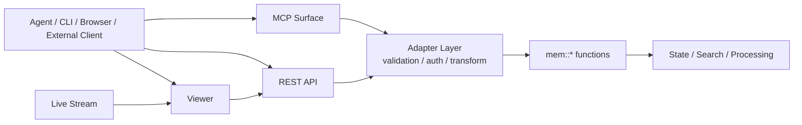
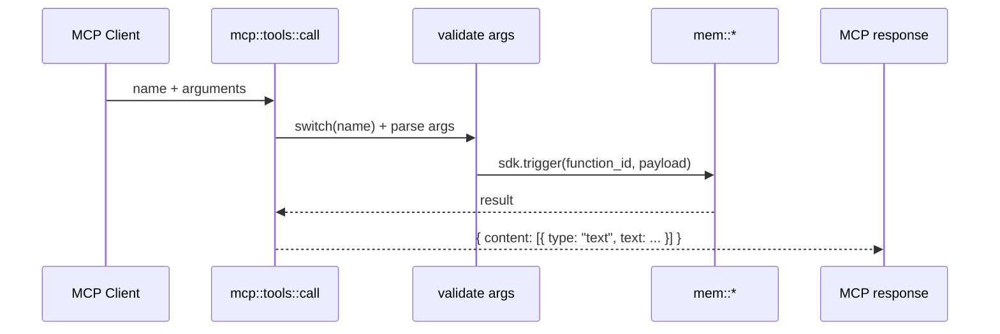

# agentmemory 接口层实现细节

本文是一份接口层参考文档，面向第一次接手 `agentmemory` 的开发者。

它重点回答下面几个问题：

1. 接口层在整个系统里负责什么。
2. `MCP`、`REST`、`viewer`、`stream` 分别暴露什么能力。
3. 外部请求如何映射到底层 `mem::*` 函数。
4. 参数校验、鉴权、可见性和返回包装是如何实现的。

本文聚焦 `4.5 接口层`，重点覆盖 `MCP + REST` 主链路，并补充 viewer、stream、resources、prompts 这几类对外表面。

## 1. 接口层职责

接口层位于各类 `mem::*` 业务函数之外，是系统对外暴露能力的适配层。

如果说：

- 采集层负责把代理行为送进系统
- 处理层负责把 observation 变成结构化结果
- 记忆层负责保存状态对象
- 检索层负责把相关内容找回来

那么接口层负责的就是：

- 给外部客户端提供稳定的访问入口
- 把外部协议转换成内部 `mem::*` 调用
- 做边界校验、参数收敛、鉴权和返回包装

它不负责：

- 核心业务逻辑本身
- 状态建模
- 检索排序
- LLM 压缩或图谱抽取

它更像一层适配器集合：

- `MCP` 适配器
- `REST` 适配器
- `viewer` 适配器
- `stream` 消费面

## 2. 总体结构

接口层的总体结构可以理解为“多个入口，共享同一组 `mem::*` 函数”。



这张图表达了几个关键事实：

- `MCP` 和 `REST` 最终都会落到内部 `mem::*`。
- `viewer` 不直接重写业务逻辑，而是主要消费已有 REST 和流事件。
- 接口层的核心价值不是“再实现一遍功能”，而是“把能力包装成不同接入面”。

## 3. 运行时装配

在 `src/index.ts` 中，系统启动后会完成三件与接口层直接相关的事情：

1. 注册 REST 端点：`registerApiTriggers(sdk, kv, secret, ...)`
2. 注册 MCP 表面：`registerMcpEndpoints(sdk, kv, secret)`
3. 启动独立 viewer server：`startViewerServer(viewerPort, ..., secret, restPort)`

这说明接口层不是单一服务器，而是：

- 一组由 iii-engine 注册的 HTTP triggers
- 一个额外的本地 viewer 代理服务

当前启动日志还会显式输出：

- REST API 地址
- MCP surface 工具数量
- viewer 地址

因此，接口层的运行时装配点主要看 `src/index.ts`。

## 4. MCP 主链路

### 4.1 工具定义：`tools-registry.ts`

MCP 工具的第一层是工具目录声明。

`src/mcp/tools-registry.ts` 负责定义：

- 工具名
- 描述
- 输入 schema

一个工具定义的最小形态是：

- `name`
- `description`
- `inputSchema`

例如：

- `memory_recall`
- `memory_save`
- `memory_smart_search`
- `memory_profile`
- `memory_relations`

接口层在这里并不执行业务逻辑，只负责声明“这个工具长什么样”。

### 4.2 工具可见性

工具注册表还定义了两个重要函数：

- `getAllTools()`
- `getVisibleTools()`

其中：

- `getAllTools()` 返回完整 MCP surface
- `getVisibleTools()` 根据 `AGENTMEMORY_TOOLS` 决定实际对外暴露什么

当前逻辑是：

- 默认 `AGENTMEMORY_TOOLS=core`
- 只暴露 essential tool 集
- 当 `AGENTMEMORY_TOOLS=all` 时才暴露全部工具

这说明 MCP 层不是“所有能力默认都给外部看见”，而是有一层显式的产品化裁剪。

### 4.3 工具调用入口：`mcp::tools::call`

MCP 的实际调用入口在 `src/mcp/server.ts`：

- `mcp::tools::list`
- `mcp::tools::call`

其中：

- `mcp::tools::list` 返回当前可见工具
- `mcp::tools::call` 处理具体调用

调用过程可以概括成下面这条链路：



这条链路里的关键步骤是：

1. 先做 `name` 存在性校验。
2. 进入 `switch` 按工具名分发。
3. 在 case 内部做类型和范围检查。
4. 把参数转换成内部 payload。
5. 调用对应 `mem::*`。
6. 把结果包装成 MCP 兼容格式。

### 4.4 MCP 到 `mem::*` 的映射方式

MCP 层的每个工具基本都遵循相同模式：

- 工具名是产品化命名
- 底层函数名仍是 `mem::*`

例如：

| MCP 工具 | 底层函数 |
| --- | --- |
| `memory_recall` | `mem::search` |
| `memory_save` | `mem::remember` |
| `memory_file_history` | `mem::file-context` |
| `memory_smart_search` | `mem::smart-search` |
| `memory_profile` | `mem::profile` |
| `memory_export` | `mem::export` |
| `memory_relations` | `mem::get-related` |

这层映射的作用是：

- 给外部更稳定、可读的接口名
- 保留内部函数层的自由演化空间

### 4.5 MCP 返回包装

MCP 返回值通常会被包装成：

```json
{
  "content": [
    { "type": "text", "text": "..." }
  ]
}
```

这和 REST 直接返回 JSON 对象不同。

包装策略大致分成两类：

- 直接 `JSON.stringify(result, null, 2)`
- 对某些文本型结果直接返回文本，例如 narrative recall

因此，MCP 层本质上是“把内部结果转成 MCP 消息体”。

## 5. MCP resources 与 prompts

接口层不只暴露工具，还暴露：

- resources
- prompts

### 5.1 resources

`src/mcp/server.ts` 中定义了：

- `mcp::resources::list`
- `mcp::resources::read`

资源的特点是：

- 用 URI 表达
- 适合读取稳定只读视图

当前资源示例包括：

- `agentmemory://status`
- `agentmemory://project/{name}/profile`
- `agentmemory://project/{name}/recent`
- `agentmemory://memories/latest`
- `agentmemory://graph/stats`
- `agentmemory://team/{id}/profile`

资源读取时：

- 会先解析 URI
- 再读取 KV 或调用 `mem::*`
- 最终返回 `contents[]`

这说明 resource 更像“只读信息视图”，而不是动作型接口。

### 5.2 prompts

同一个文件里还定义了：

- `mcp::prompts::list`
- `mcp::prompts::get`

当前 prompt 主要包括：

- `recall_context`
- `session_handoff`
- `detect_patterns`

prompt 的定位是：

- 给 MCP 客户端返回一段可直接喂给模型的消息
- 把底层搜索、summary、pattern 检测结果组织成提示词片段

也就是说，prompt 比 tool 更靠近“可用上下文模板”。

## 6. REST 主链路

### 6.1 入口：`registerApiTriggers`

REST 接口统一在 `src/triggers/api.ts` 中注册。

它的实现模式非常统一：

1. `sdk.registerFunction("api::...")`
2. 在函数里解析并校验请求
3. 调用对应 `mem::*`
4. `sdk.registerTrigger({ type: "http", ... })` 暴露成 HTTP 端点

这说明 REST 层不是独立的 Express/Fastify 服务，而是基于 iii-engine trigger 系统提供的 HTTP 面。

### 6.2 鉴权

REST 层的鉴权核心有两种形态：

- `checkAuth(req, secret)`
- `middleware::api-auth`

它们都基于同一规则：

- 如果未配置 `AGENTMEMORY_SECRET`，则不拦截
- 如果已配置，则要求 `Authorization: Bearer <secret>`

比较使用了 `timingSafeCompare`，避免直接字符串比较带来的时序侧信道问题。

这说明 REST 层的安全边界是：

- 本地默认可轻量运行
- 一旦作为服务暴露，就可以通过统一 Bearer secret 收口

### 6.3 REST 到 `mem::*` 的映射

REST 层和 MCP 层一样，本质也是映射层。

例如：

| REST 端点 | 底层函数 |
| --- | --- |
| `/agentmemory/observe` | `mem::observe` |
| `/agentmemory/context` | `mem::context` |
| `/agentmemory/search` | `mem::search` |
| `/agentmemory/compress-file` | `mem::compress-file` |
| `/agentmemory/viewer` | viewer HTML，而不是 `mem::*` |
| `/agentmemory/config/flags` | 配置与能力状态聚合 |
| `/agentmemory/health` | 健康状态聚合 |

这里可以看出 REST 层分成两类端点：

- 业务函数映射端点
- 平台/运维/可视化端点

### 6.4 参数白名单和显式收敛

REST 层有一个很重要的实现原则：

- 不把原始 `req.body` 直接透传给 `sdk.trigger`

而是：

- 用 `asNonEmptyString`
- `parseOptionalPositiveInt`
- `parseOptionalFiniteNumber`
- 显式字段组装

例如 `api::context` 会显式构造：

- `sessionId`
- `project`
- `budget`

而不会直接把整个 body 原封不动传给 `mem::context`。

这保证了：

- 接口边界清晰
- 参数错误尽早暴露
- 底层函数不需要承接杂乱 HTTP 输入

### 6.5 REST 返回

REST 层的返回形态通常更直接：

- `status_code`
- `headers`
- `body`

相较 MCP 层，它更接近普通 JSON API。

例如：

- 校验失败返回 `400`
- 未授权返回 `401`
- 某些功能未启用返回 `503`

这说明 REST 层承担了更标准的服务接口语义。

## 7. viewer

### 7.1 viewer 的两种暴露方式

viewer 在当前实现里有两个相关入口：

- `api::viewer`：直接通过 `/agentmemory/viewer` 返回 HTML
- `startViewerServer()`：启动一个独立本地 HTTP 代理服务

这两者的关系是：

- `api::viewer` 提供原始 viewer 页面能力
- `viewer/server.ts` 提供更方便的浏览器入口和对 REST API 的代理

### 7.2 viewer 文档生成

`src/viewer/document.ts` 负责：

- 加载 `index.html` 模板
- 生成 nonce
- 注入版本号
- 构建 CSP

因此 viewer 页面本身不是手写字符串，而是一个带 CSP 和 nonce 的模板化文档。

### 7.3 viewer 代理模式

`startViewerServer()` 会在 `restPort + 2` 附近启动一个独立 HTTP server。

它做两件事：

- 访问 `/`、`/viewer`、`/agentmemory/viewer` 时返回 HTML
- 其他请求代理到 REST API

代理时它会：

- 自动补齐 `/agentmemory` 前缀
- 若配置了 secret，则自动加 `Authorization` 头
- 转发 `Content-Type`
- 设置 CORS
- 为上游请求加超时

这说明 viewer server 本质上是：

- 面向浏览器的本地网关
- 同时解决静态页面分发和 REST 透传

### 7.4 端口回退

viewer server 还有一个实用的运维细节：

- 若默认端口被占用，会自动在一个小范围内递增重试

这能降低本地开发时因端口冲突导致 viewer 完全不可用的概率。

## 8. 实时流：stream 与 viewer 的关系

接口层本身不创建流数据，但它暴露并消费流数据。

当前流的命名在 `src/state/schema.ts` 中定义为：

- `STREAM.name = "mem-live"`
- 会话组：`STREAM.group(sessionId)`
- viewer 组：`STREAM.viewerGroup = "viewer"`

### 8.1 会话组与 viewer 组

流事件至少分成两类广播目标：

- 会话级组：面向单个 session 的实时 observation 流
- viewer 组：面向全局 dashboard / viewer 的广播流

例如在 `mem::observe` 中：

- raw observation 会写入 session group
- 同时也会向 viewer group 发送 `raw_observation`

在压缩后：

- 压缩 observation 再次更新 session group
- 同时向 viewer group 发送 `compressed_observation`

### 8.2 状态驱动的 viewer 事件

`src/triggers/events.ts` 里还注册了一个状态触发器：

- 监听 `KV.sessions`
- 当 `observationCount` 增长时，向 viewer group 发送 `session.activity`

这说明 viewer 看到的不只是 observation 明细流，还包括更轻量的活动通知流。

### 8.3 接口层对 stream 的意义

从接口层视角看，stream 的作用不是替代 REST，而是补上：

- 低延迟实时刷新
- dashboard / viewer 的事件推送

因此可以这样理解两者关系：

- REST 负责按需读取
- stream 负责实时推送

## 9. 关键边界条件

### 9.1 MCP 和 REST 的职责差异

虽然二者都能调用 `mem::*`，但职责不同：

- MCP 偏向给 agent 调用
- REST 偏向标准 HTTP 接入

具体体现为：

- MCP 返回 `content[]`
- REST 返回标准 JSON body

### 9.2 默认最小暴露原则

MCP 默认不是全量暴露，而是只暴露核心工具。

只有设置：

- `AGENTMEMORY_TOOLS=all`

时，完整工具集合才会对外可见。

### 9.3 特性开关型接口

某些 REST 端点依赖特性开关，例如：

- Graph
- Consolidation
- Auto compress

当特性未启用时，接口层会返回明确的 `503` 和启用说明，而不是沉默失败。

### 9.4 viewer 并不绕过 REST

viewer server 虽然是独立 HTTP 服务，但它大部分数据仍然来自 REST 代理。

也就是说：

- viewer 不是第二套 API
- 它是 REST API 的浏览器友好包装面

### 9.5 接口层失败不应污染业务函数

无论是：

- 参数类型错误
- URI 解析失败
- 缺少鉴权头
- viewer 上游超时

这些错误都尽量在接口层终止，不把脏输入继续往 `mem::*` 传。

## 10. 一次完整请求示例

下面用两条典型路径说明接口层如何工作。

### 10.1 MCP `memory_smart_search`

处理过程：

1. MCP 客户端调用 `memory_smart_search`
2. `mcp::tools::call` 根据工具名进入对应 `case`
3. 接口层校验 `query`、`limit`、`expandIds`
4. 把参数整理成 `mem::smart-search` payload
5. 调用 `sdk.trigger({ function_id: "mem::smart-search", ... })`
6. 将结果包装为 `content[]`
7. 返回给 MCP 客户端

### 10.2 REST `/agentmemory/search`

处理过程：

1. 客户端向 `/agentmemory/search` 发 POST 请求
2. `api::search` 解析 body
3. 接口层校验 `query`、`limit`、`format`、`token_budget`
4. 显式构造 payload
5. 调用 `mem::search`
6. 把结果直接放入 HTTP response body
7. 返回标准 JSON

这两条路径说明：

- 调用入口不同
- 业务函数相同
- 返回协议不同

## 11. 关键代码导航

如果你要从代码继续往下追，建议按这个顺序阅读：

| 路径 | 阅读目的 |
| --- | --- |
| `src/index.ts` | 理解接口层如何在启动时装配 |
| `src/mcp/tools-registry.ts` | 理解 MCP 工具目录、schema 和可见性策略 |
| `src/mcp/server.ts` | 理解 MCP tools/resources/prompts 的 HTTP 包装和分发 |
| `src/triggers/api.ts` | 理解 REST 端点注册、鉴权和参数收敛 |
| `src/viewer/document.ts` | 理解 viewer HTML 如何生成 |
| `src/viewer/server.ts` | 理解 viewer 如何代理到 REST API |
| `src/triggers/events.ts` | 理解 viewer 相关的实时活动流广播 |
| `src/state/schema.ts` | 理解 `STREAM` 和关键 scope 常量 |

## 12. 一句话总结

接口层的本质可以概括为：

> 用 MCP、REST、viewer 和 stream 这几种不同表面，把同一套 `mem::*` 能力包装成适合 agent、浏览器和外部系统消费的稳定入口。

如果你已经理解这份文档，下一步最自然的延伸就是阅读：

- `docs/retrieval-layer-reference.md`
- `docs/memory-layer-reference.md`
- `docs/architecture.md`
