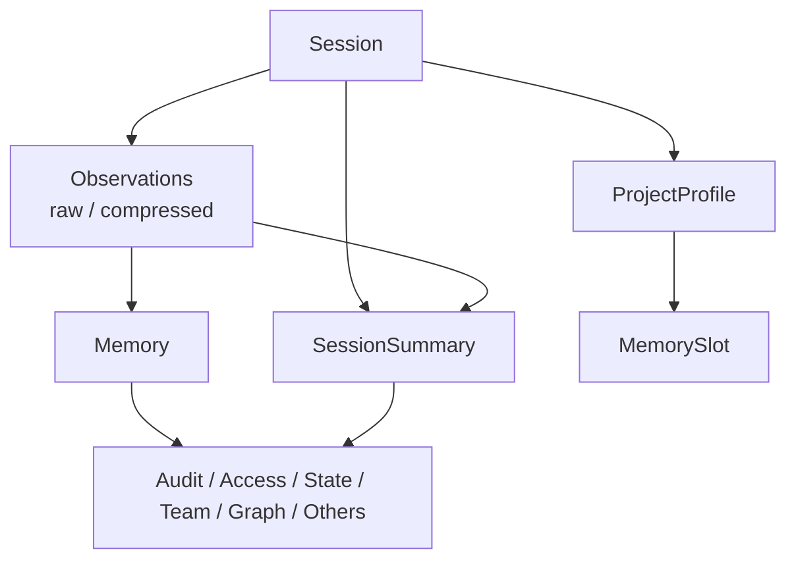
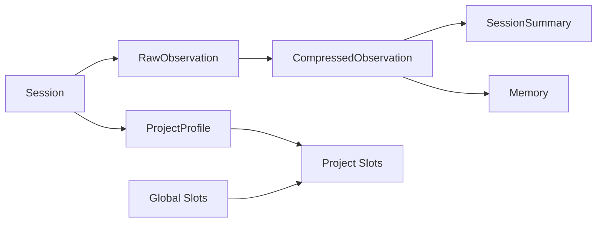

# agentmemory 记忆层实现细节

本文是一份记忆层参考文档，面向第一次接手 `agentmemory` 的开发者。

它重点回答下面几个问题：

1. 记忆层在整个系统里负责什么。
2. `Session`、`Observation`、`Summary`、`Memory`、`Profile`、`Slot` 这些对象如何组织。
3. 这些对象分别存在哪些 KV scope 中。
4. 对象之间如何关联、演化和被下游使用。

本文聚焦 `4.3 记忆层`，重点覆盖对象模型和 KV scope，不展开完整检索层与接口层。

## 1. 记忆层职责

记忆层位于采集层和处理层之后，是整个系统的持久化状态中心。

如果说：

- 采集层解决“把代理行为送进系统”
- 处理层解决“把行为转成结构化结果”
- 检索层解决“怎么把相关内容取回来”

那么记忆层解决的就是：

- 这些对象最终以什么状态模型存在。
- 它们分别写入哪个 scope。
- 它们之间如何保持关联和演化关系。

因此，记忆层的核心职责可以概括为三类：

- 承载系统的核心业务对象。
- 为不同对象提供稳定的命名空间和作用域。
- 为检索、导出、治理、团队共享和扩展能力提供统一状态基础。

它不直接负责：

- hook 捕获
- 压缩与总结逻辑本身
- 检索排序
- 对外接口协议

它是整个系统的“长期状态模型”。

## 2. 状态总览

从概念上看，记忆层主要由两部分组成：

- 核心对象：`Session`、`Observation`、`SessionSummary`、`Memory`、`ProjectProfile`、`MemorySlot`
- 状态作用域：由 `KV` 常量定义的一组 scope

这张图表达的不是调用顺序，而是对象层级关系：

- `Session` 是组织 observation 的容器。
- `Observation` 是最细粒度的会话记录。
- `SessionSummary` 是 session 级压缩结果。
- `Memory` 是独立于 session 桶的长期记忆对象。
- `ProjectProfile` 和 `MemorySlot` 更偏项目级或全局级上下文对象。

## 3. 核心对象模型

### 3.1 `Session`

`Session` 是会话级元信息对象。

核心字段包括：

- `id`
- `project`
- `cwd`
- `startedAt`
- `endedAt`
- `status`
- `observationCount`
- `firstPrompt`
- `summary`

它的职责不是保存详细内容，而是作为 observation、summary、project profile 的组织单位。

可以把它理解成：

- 会话边界
- 项目归属
- 基础统计

### 3.2 `RawObservation`

`RawObservation` 是 observation 的原始形态。

它包含：

- 基础标识：`id`、`sessionId`、`timestamp`、`hookType`
- 便捷字段：`toolName`、`toolInput`、`toolOutput`、`userPrompt`
- 原始数据：`raw`
- 模态信息：`modality`、`imageData`

这里要注意一个非常关键的设计点：

- `RawObservation` 不是独立永久保留在另一张表里的对象
- 它通常作为 observation 在早期阶段的形态存在，随后会被压缩结果覆盖写回同一 scope

也就是说，记忆层里的 observation scope 实际承载的是“当前 observation 版本”，而不区分 raw 表和 compressed 表。

### 3.3 `CompressedObservation`

`CompressedObservation` 是检索和总结真正依赖的 observation 形态。

核心字段包括：

- `type`
- `title`
- `subtitle`
- `facts`
- `narrative`
- `concepts`
- `files`
- `importance`
- `confidence`
- 图像相关字段

它和 `RawObservation` 的最大区别在于：

- `RawObservation` 强调“发生了什么”
- `CompressedObservation` 强调“什么值得被记住、搜索和总结”

### 3.4 `SessionSummary`

`SessionSummary` 是 session 级对象。

核心字段包括：

- `sessionId`
- `project`
- `createdAt`
- `title`
- `narrative`
- `keyDecisions`
- `filesModified`
- `concepts`
- `observationCount`

它的定位是：

- 会话级浓缩结果
- `mem::context` 的优先输入
- 导出与回顾时的重要对象

### 3.5 `Memory`

`Memory` 是独立于 session 桶之外的长期记忆对象。

核心字段包括：

- 基础内容：`title`、`content`、`type`
- 检索辅助：`concepts`、`files`
- 强度与生命周期：`strength`、`forgetAfter`
- 版本关系：`version`、`parentId`、`supersedes`、`relatedIds`
- 溯源关系：`sourceObservationIds`
- 当前语义：`isLatest`

它与 observation 的区别在于：

- observation 更像事件记录
- memory 更像被显式保存或抽取出来的稳定知识对象

### 3.6 `ProjectProfile`

`ProjectProfile` 是项目级聚合对象。

核心字段包括：

- `project`
- `updatedAt`
- `topConcepts`
- `topFiles`
- `conventions`
- `commonErrors`
- `recentActivity`
- `sessionCount`
- `totalObservations`

它不是单次会话结果，而是跨 session 的项目画像。

它的主要用途是：

- 提供项目级上下文摘要
- 为 `mem::context` 提供高层背景信息

### 3.7 `MemorySlot`

`MemorySlot` 是可编辑、可固定注入的槽位对象。

核心字段包括：

- `label`
- `content`
- `sizeLimit`
- `description`
- `pinned`
- `readOnly`
- `scope`
- `createdAt`
- `updatedAt`

Slot 的定位不是“自动推导出的记忆”，而是：

- 明确可编辑的长期上下文容器
- 适合保存人格、用户偏好、项目背景、待办等内容

## 4. KV scope 组织方式

记忆层的存储分布由 `src/state/schema.ts` 中的 `KV` 常量定义。

### 4.1 核心 scope

| scope | 保存内容 |
| --- | --- |
| `KV.sessions` | `Session` |
| `KV.observations(sessionId)` | 某个 session 下的 observation |
| `KV.summaries` | `SessionSummary`，通常以 `sessionId` 为 key |
| `KV.memories` | `Memory` |
| `KV.profiles` | `ProjectProfile`，通常以 `project` 为 key |
| `KV.slots` | 项目级 `MemorySlot` |
| `KV.globalSlots` | 全局级 `MemorySlot` |

这是当前最核心的一组记忆层状态。

### 4.2 Observation 为什么按 session 分桶

observation scope 不是一个全局表，而是：

- `mem:obs:${sessionId}`

这种设计有几个直接好处：

- 会话级删除和导出更自然
- 按 session 聚合 summary 更方便
- hook 写入和会话统计可以共享同一个边界

代价也很明确：

- 跨 session 全局扫描时需要遍历多个 scope

所以检索层才需要额外的索引结构来避免频繁全量遍历。

### 4.3 Memory 为什么独立存放

`Memory` 不放在某个 session 的 observation scope 中，而是独立存在于：

- `KV.memories`

原因是：

- memory 的生命周期独立于单次 session
- memory 允许版本演化
- memory 可以由 observation 抽取，也可以显式保存

这使得 `Memory` 更接近知识库对象，而不是事件对象。

### 4.4 Profile 和 Slot 为什么独立

`ProjectProfile` 和 `MemorySlot` 也不属于某一个 session。

原因是：

- profile 是跨 session 聚合结果
- slot 是面向长期上下文注入的持久容器

因此它们被设计成更高层的上下文对象，而不是 observation 的附属字段。

## 5. 核心对象关系

下面这张图展示核心对象之间的关系。

可以按下面的方式理解：

- 一个 `Session` 下面有多个 observation。
- observation 先以 raw 形态出现，再以 compressed 形态保存。
- 多个 compressed observations 可以形成一个 `SessionSummary`。
- 某些 observation 也可以被抽取或显式保存为 `Memory`。
- 多个 session 的 observation 会聚合成 `ProjectProfile`。
- `MemorySlot` 则作为与自动聚合平行的“手工维护上下文容器”存在。

## 6. Memory 的版本语义

`Memory` 是记忆层里版本语义最强的对象。

### 6.1 `version`

`version` 表示当前 memory 在同一条演化链中的版本号。

新建时：

- 若没有近似重复的旧 memory，则从 `1` 开始
- 若检测到高相似度旧 memory，则继承旧链并 `+1`

### 6.2 `parentId`

`parentId` 指向被当前 memory 取代或延续的上一条 memory。

它体现的是：

- 演化来源
- 继承关系

### 6.3 `supersedes`

`supersedes` 是被当前 memory 替代的 memory ID 列表。

当前实现里通常是单元素数组，但字段设计允许未来扩展成多重替代关系。

### 6.4 `isLatest`

`isLatest` 表示这条 memory 是否仍然是当前有效版本。

当新 memory 取代旧 memory 时：

- 新 memory 的 `isLatest = true`
- 旧 memory 会被写回为 `isLatest = false`

这让系统能够同时做到：

- 保留历史
- 查询时优先使用当前版本

### 6.5 `sourceObservationIds`

这个字段用于表达记忆的来源 observation。

它的意义在于：

- 保留溯源关系
- 支持后续验证、审计和上下文解释

可以把它理解成：

- “这条 memory 是基于哪些 observation 得出来的”

## 7. 关键对象从哪里来

### 7.1 `Session`

`Session` 主要在 `/agentmemory/session/start` 中创建，并写入 `KV.sessions`。

后续 observation 写入还会更新：

- `updatedAt`
- `observationCount`
- `firstPrompt`

### 7.2 Observation

observation 主要由 `mem::observe` 写入 `KV.observations(sessionId)`。

这里有一个很重要的实现细节：

- raw observation 先写入
- 后续 synthetic 或 LLM 压缩结果再覆盖写回同一个 key

所以 observation scope 存的是“当前版本”，不是双轨持久化。

### 7.3 `SessionSummary`

`SessionSummary` 由 `mem::summarize` 生成并写入 `KV.summaries`。

它通常以 `sessionId` 作为 key，与 session 一一对应。

### 7.4 `Memory`

`Memory` 由两类路径进入系统：

- 显式调用 `mem::remember`
- 未来可能的自动抽取或更高层处理链

当前 `mem::remember` 的逻辑会：

- 校验输入
- 用 Jaccard 相似度查找近似旧 memory
- 若命中则形成新版本，并把旧版本标成 `isLatest = false`
- 写入 `KV.memories`
- 同时把它加入 BM25 和向量索引

### 7.5 `ProjectProfile`

`ProjectProfile` 由 `mem::profile` 动态生成并缓存到 `KV.profiles`。

它会扫描同项目 session 的 observations，聚合：

- top concepts
- top files
- errors
- recent activity
- conventions

它不是持续实时维护的，而是按需生成并带缓存时间。

### 7.6 `MemorySlot`

`MemorySlot` 由 slot 系列函数管理，例如：

- `mem::slot-list`
- `mem::slot-get`
- `mem::slot-create`
- `mem::slot-append`
- `mem::slot-replace`

启动时还会根据 `DEFAULT_SLOTS` 自动播种一组默认槽位。

这些默认槽位包括：

- `persona`
- `user_preferences`
- `tool_guidelines`
- `project_context`
- `guidance`
- `pending_items`
- `session_patterns`
- `self_notes`

## 8. 扩展状态与非核心 scope

除了核心对象外，记忆层还包含很多辅助或扩展 scope。

### 8.1 审计与访问相关

| scope | 作用 |
| --- | --- |
| `KV.audit` | 记录状态变更审计 |
| `KV.accessLog` | 记录 memory / observation 的访问情况 |
| `KV.state` | 保存运行时状态类信息 |

这些 scope 不直接承载核心记忆内容，但会影响治理和排序。

### 8.2 图谱与高阶记忆

| scope | 作用 |
| --- | --- |
| `KV.graphNodes` | 图节点 |
| `KV.graphEdges` | 图边 |
| `KV.graphEdgeHistory` | 图边历史 |
| `KV.semantic` | 语义记忆 |
| `KV.procedural` | 过程记忆 |
| `KV.retentionScores` | 保留评分 |

这些对象属于更高阶能力，但本质上仍是记忆层的状态扩展。

### 8.3 团队与协作相关

| scope | 作用 |
| --- | --- |
| `KV.teamShared(teamId)` | 团队共享记忆 |
| `KV.teamUsers(teamId, userId)` | 团队内用户维度状态 |
| `KV.teamProfile(teamId)` | 团队画像 |
| `KV.signals` | 协作信号 |
| `KV.leases` | 多代理排它租约 |
| `KV.actions` / `KV.actionEdges` | 工作项与依赖 |

它们说明记忆层不只是“回忆过去”，还承担了协作状态底座的角色。

### 8.4 图片与嵌入相关

| scope | 作用 |
| --- | --- |
| `KV.imageRefs` | 图片引用计数 |
| `KV.imageEmbeddings` | 图像向量索引数据 |
| `KV.embeddings(obsId)` | 单 observation 的 embedding 相关状态 |
| `KV.latentEmbeddings(obsId)` | 潜在嵌入状态 |

这些对象不直接给用户阅读，但属于记忆层的底层资产。

## 9. 边界条件与设计取舍

记忆层的核心设计原则是：

> 用明确分层的状态对象，换取更清晰的生命周期和更可控的下游使用方式。

下面是几个重要取舍。

### 9.1 observation 不拆成多个永久表

当前 observation 使用同一 scope、同一 key 承载 raw 和 compressed 的不同阶段。

好处：

- 状态模型更简单
- 下游读取只看一个 observation 桶

代价：

- 若要保留 raw 和 compressed 的双版本长期对照，需要额外机制

### 9.2 memory 独立于 session

这让 memory 可以：

- 跨 session 长期存在
- 做版本演化
- 独立参与检索

代价是它不再天然属于某个 session 桶，需要额外维护 `sessionIds` 和溯源关系。

### 9.3 project/global slot 双层作用域

slot 设计成 project 与 global 两层，是为了同时满足：

- 全局长期偏好
- 项目局部上下文

读取时 project slot 可以覆盖同名 global slot，这是一种有意的 shadowing 设计。

### 9.4 profile 是聚合缓存，不是事实源

`ProjectProfile` 来自 observations 的统计与抽取。

因此它更像：

- 衍生对象
- 聚合缓存

而不是最底层的事实源。

## 10. 一次对象演化示例

下面用一次典型路径串起记忆层对象的演化。

场景：

- 用户开始一个新 session。
- 期间产生多个 observation。
- 会话结束后生成 summary。
- 其中一个关键结论被显式保存为 memory。

对象演化过程：

1. `/session/start` 创建 `Session` 并写入 `KV.sessions`
2. `mem::observe` 将事件写入 `KV.observations(sessionId)`
3. 处理层将 observation 压缩后覆盖写回同一 observation key
4. `mem::summarize` 从该 session 的 observations 生成 `SessionSummary`
5. `SessionSummary` 写入 `KV.summaries`
6. 用户调用 `mem::remember`
7. 系统创建 `Memory` 并写入 `KV.memories`
8. 若内容与旧 memory 高度相似，则旧 memory 被标记为 `isLatest = false`
9. `ProjectProfile` 在后续按需生成时，会聚合该项目下多个 session 的 observations
10. `MemorySlot` 则作为长期人工维护上下文，与自动演化路径平行存在

这说明记忆层不是单一对象库，而是一组不同抽象层级的状态对象共同工作。

## 11. 关键代码导航

如果你要从代码继续往下追，建议按这个顺序阅读：

| 路径 | 阅读目的 |
| --- | --- |
| `src/types.ts` | 建立核心对象模型全貌 |
| `src/state/schema.ts` | 理解 scope 命名和分布 |
| `src/state/kv.ts` | 理解状态读写抽象 |
| `src/functions/observe.ts` | 理解 observation 如何进入 session scope |
| `src/functions/summarize.ts` | 理解 summary 如何写入 |
| `src/functions/remember.ts` | 理解 memory 的版本和 latest 语义 |
| `src/functions/profile.ts` | 理解 profile 的聚合来源 |
| `src/functions/slots.ts` | 理解 slot 的作用域、默认值和编辑规则 |
| `src/functions/export-import.ts` | 理解导出视角下哪些对象被视为记忆层数据 |

## 12. 一句话总结

记忆层的本质可以概括为：

> 用一组分层的状态对象，把“会话事件”“长期知识”“项目画像”和“人工维护上下文”组织成可持久化、可演化、可检索的统一底座。

如果你已经理解这份文档，下一步最自然的延伸就是阅读：

- `docs/processing-layer-reference.md`
- `docs/retrieval-layer-reference.md`
- `docs/collection-layer-reference.md`
