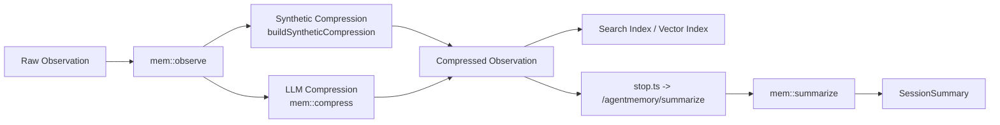

# agentmemory 处理层实现细节

本文是一份处理层参考文档，面向第一次接手 `agentmemory` 的开发者。

它重点回答下面几个问题：

1. 处理层在整个系统里负责什么。
2. raw observation 如何被转换成可检索的 compressed observation。
3. 默认 synthetic 路径和 LLM 压缩路径有什么区别。
4. session summary 是如何生成并交给下游使用的。

本文聚焦 `4.2 处理层`，重点覆盖压缩与总结主链路，不展开检索层、接口层和更高阶整合能力的完整实现。

## 1. 处理层职责

处理层位于采集层和记忆层之间。

如果说采集层解决的是“代理刚刚做了什么”，那么处理层解决的就是：

- 这些行为应该以什么形式被保留下来。
- 哪些字段值得保留为长期搜索和总结的输入。
- 在没有 LLM、没有 embedding 或部分能力失败时，系统仍然如何继续工作。

因此，处理层的职责可以概括为三类：

- 把 `RawObservation` 转换成结构更稳定的 `CompressedObservation`。
- 把一个 session 内的 observation 汇总为 `SessionSummary`。
- 为下游索引、上下文组装和记忆演化提供标准化中间产物。

处理层不直接负责：

- hook 事件捕获
- API 接入
- 召回排序
- MCP/REST 输出格式

它是整个系统从“行为记录”走向“可用记忆”的第一道结构化处理层。

## 2. 总体结构

处理层的主链路可以拆成两条：

- observation 级处理：`RawObservation -> CompressedObservation`
- session 级处理：`CompressedObservation[] -> SessionSummary`



这张图表达了三个关键事实：

- 压缩是 observation 级处理，发生得很早。
- 总结是 session 级处理，通常发生在会话结束边界。
- 处理层的结果不会停留在本层，而是直接喂给索引、上下文和更高层能力。

## 3. 关键入口

处理层相关的主要代码入口如下：

| 路径 | 角色 | 说明 |
| --- | --- | --- |
| `src/functions/observe.ts` | 处理链路启动点 | 在写入 raw observation 后触发压缩路径 |
| `src/functions/compress-synthetic.ts` | 默认压缩实现 | 不依赖 LLM 的零成本结构化路径 |
| `src/functions/compress.ts` | LLM 压缩实现 | 使用 provider 把 raw observation 压成结构化 XML |
| `src/functions/summarize.ts` | session 总结实现 | 把一组 compressed observations 汇总成 session summary |
| `src/prompts/compression.ts` | observation 压缩 prompt | 约束 LLM 输出结构 |
| `src/prompts/summary.ts` | session 总结 prompt | 约束 summary 输出结构 |
| `src/hooks/stop.ts` | 总结触发边界 | 在会话结束时调用 `/agentmemory/summarize` |

如果你要读处理层源码，建议顺序是：

1. `observe.ts`
2. `compress-synthetic.ts`
3. `compress.ts`
4. `summarize.ts`

## 4. 数据模型

### 4.1 `RawObservation`

处理层的输入通常是 `RawObservation`。它来自采集层，已经过基本清洗、字段提取和模态标注。

它保留了如下信息：

- `hookType`
- `toolName`
- `toolInput`
- `toolOutput`
- `userPrompt`
- `raw`
- `modality`
- `imageData`

处理层并不再回到 hook 原始 payload，而是以 `RawObservation` 作为统一起点。

### 4.2 `CompressedObservation`

处理层的 observation 级标准输出是 `CompressedObservation`。

它包含以下核心字段：

- `type`
- `title`
- `subtitle`
- `facts`
- `narrative`
- `concepts`
- `files`
- `importance`
- `confidence`
- 可选的图像相关字段

这个模型体现出处理层的基本目标：

- 不再保留原始交互噪音。
- 转而保留可搜索、可排序、可总结的结构化语义。

### 4.3 `SessionSummary`

处理层在 session 级的输出是 `SessionSummary`，它包含：

- `title`
- `narrative`
- `keyDecisions`
- `filesModified`
- `concepts`
- `observationCount`

相比 `CompressedObservation`，它更强调整轮工作发生了什么，而不是单次工具调用发生了什么。

## 5. 默认路径：synthetic compression

### 5.1 为什么有 synthetic compression

`agentmemory` 当前默认不会对每个 observation 都调用 LLM。

这是一个有意的默认值，目标包括：

- 避免每次工具调用都产生额外 token 成本。
- 在没有 LLM provider 时仍保留基本可用能力。
- 保证 observation 写入后，系统总能得到一个最小可用的结构化结果。

因此，synthetic compression 是默认路径，而不是备用路径。

### 5.2 入口位置

在 `src/functions/observe.ts` 中，raw observation 写入后会分叉：

- 如果 `AGENTMEMORY_AUTO_COMPRESS=true`，触发 `mem::compress`
- 否则调用 `buildSyntheticCompression(raw)`

也就是说，synthetic compression 是 `mem::observe` 的内联后处理步骤。

### 5.3 `buildSyntheticCompression()` 做了什么

`src/functions/compress-synthetic.ts` 的职责是基于启发式规则，把 `RawObservation` 转成最小可用的 `CompressedObservation`。

它的处理主要包括：

- 推断 `type`
- 提取 `files`
- 拼接 `narrative`
- 设置默认 `importance`
- 设置较低的默认 `confidence`

### 5.4 类型推断

`inferType()` 先看 `hookType`，再看 `toolName`。

优先级大致如下：

- `post_tool_failure` -> `error`
- `prompt_submit` -> `conversation`
- `subagent_stop` / `task_completed` -> `subagent`
- `notification` -> `notification`

若仍不能直接判断，就对工具名做归一化，把 camelCase 和 kebab-case 打散，再匹配词块：

- `fetch` / `http` / `web` -> `web_fetch`
- `grep` / `search` / `glob` / `find` -> `search`
- `bash` / `shell` / `exec` / `run` -> `command_run`
- `edit` / `update` / `patch` / `replace` -> `file_edit`
- `write` / `create` -> `file_write`
- `read` / `view` -> `file_read`

这一策略的特点是：

- 成本低
- 可预期
- 不追求语义最优，但足以支撑默认检索和 summary

### 5.5 文件提取

`extractFiles()` 会从 `toolInput` 中尝试读取一组常见键：

- `file_path`
- `filepath`
- `path`
- `filePath`
- `file`
- `pattern`

这说明 synthetic compression 不依赖复杂语义抽取，而是优先保留可直接定位源码位置的路径信息。

### 5.6 narrative 生成

synthetic narrative 的拼接来源很直接：

- `userPrompt`
- `toolInput`
- `toolOutput`

三者会被转成字符串后拼接，再统一截断到固定长度。

因此 synthetic compression 的 `narrative` 更接近“压缩后的行为记录”，而不是高质量自然语言总结。

### 5.7 结果特征

默认 synthetic 结果有几个固定特征：

- `importance = 5`
- `confidence = 0.3`
- `title` 来自 `toolName` 或 `hookType`
- `subtitle` 常来自输入字符串的前半部分

这说明 synthetic compression 的目标不是做智能判断，而是提供一个稳定、便宜、结构统一的中间结果。

## 6. LLM 路径：`mem::compress`

### 6.1 何时进入 LLM 压缩

只有当 `AGENTMEMORY_AUTO_COMPRESS=true` 时，`observe.ts` 才会触发：

```ts
await sdk.trigger({
  function_id: "mem::compress",
  payload: { observationId, sessionId, raw },
  action: TriggerAction.Void(),
});
```

这意味着：

- LLM 压缩是显式 opt-in。
- 即使启用，也作为异步后处理运行，不阻塞主写入路径。

### 6.2 prompt 组织方式

`src/prompts/compression.ts` 提供两部分：

- `COMPRESSION_SYSTEM`
- `buildCompressionPrompt()`

system prompt 要求 provider 输出严格 XML，字段包括：

- `type`
- `title`
- `subtitle`
- `facts`
- `narrative`
- `concepts`
- `files`
- `importance`

而 `buildCompressionPrompt()` 会把 observation 组织成：

- 时间戳
- hook 类型
- 工具名
- 输入
- 输出
- 用户 prompt

这说明 LLM 压缩并不是开放式摘要，而是“受格式约束的结构抽取”。

### 6.3 图片处理

若 observation 带有图片，并且 provider 支持 `describeImage()`，`mem::compress` 会优先尝试生成图片描述。

路径大致是：

1. 判断 observation 是否为 `image` 或 `mixed`
2. 如果 `imageData` 是托管路径，则从磁盘读取图片
3. 调用 `provider.describeImage()`
4. 将得到的描述拼接进 `toolOutput`

如果视觉描述失败，系统会：

- 记录 warn 日志
- 回退到纯文本压缩

这再次体现出处理层的策略：增强失败不影响主路径。

### 6.4 XML 解析与校验

provider 返回结果后，`mem::compress` 会经过三层处理：

1. `parseCompressionXml()`：把 XML 解析为 observation 结构
2. `validateOutput()`：根据 schema 校验字段完整性和类型
3. `scoreCompression()`：评估压缩质量并计算 `qualityScore`

如果解析失败或校验失败：

- 记录指标
- 输出 warn 日志
- 返回失败结果

但由于它是异步后处理，失败不会回滚原始 observation。

### 6.5 最终写回

压缩成功后，`mem::compress` 会构造一个新的 `CompressedObservation`，然后：

- 覆盖写回 `KV.observations(sessionId)`
- 加入 BM25 索引
- 尝试加入向量索引
- 广播到 session stream
- 广播到 viewer stream

也就是说，在 LLM 模式下，最终检索和总结看到的 observation 也是覆盖后的压缩结果。

### 6.6 与 synthetic 路径的差异

可以把两条路径概括成下面的对比：

| 维度 | synthetic compression | `mem::compress` |
| --- | --- | --- |
| 默认启用 | 是 | 否 |
| 依赖 LLM | 否 | 是 |
| 成本 | 低 | 高 |
| 结果质量 | 稳定但粗糙 | 更丰富、更语义化 |
| 失败影响 | 基本无 | 仅影响增强结果，不影响主写入 |
| confidence 来源 | 固定默认值 | 质量评分换算 |

## 7. 总结路径：`mem::summarize`

### 7.1 触发方式

session summary 通常在会话结束时触发。

链路是：

- `src/hooks/stop.ts`
- `POST /agentmemory/summarize`
- `api::summarize`
- `mem::summarize`

`stop.ts` 会读取宿主输入中的 `session_id`，然后 best-effort 调用 `/agentmemory/summarize`。

这意味着 session summary 是一个边界事件处理，而不是每次 observation 写入后立即触发。

### 7.2 输入来源

`mem::summarize` 的输入很简单：

- `sessionId`

但它会在内部查询：

- `KV.sessions` 中的 session 元信息
- `KV.observations(sessionId)` 中的 observation 列表

然后过滤出带 `title` 的 observation 作为总结输入。

### 7.3 provider 要求

和 synthetic compression 不同，`mem::summarize` 没有默认的零 LLM 实现。

如果当前 provider 是 `noop`：

- 总结直接跳过
- 返回 `no_provider`

这说明 session summary 被视为更高质量的语义归纳能力，而不是必须始终存在的基础功能。

### 7.4 prompt 组织方式

`src/prompts/summary.ts` 通过两部分约束总结输出：

- `SUMMARY_SYSTEM`
- `buildSummaryPrompt()`

其中：

- system prompt 要求输出固定 XML
- user prompt 会把 observation 列成结构化片段

每条 observation 在 prompt 中大致包含：

- `type`
- `title`
- `narrative`
- `facts`
- `files`

因此 summary 并不直接消费 raw observation，而是消费已经经过处理层压缩后的结果。

### 7.5 XML 解析、校验与评分

`mem::summarize` 的后处理步骤与 `mem::compress` 相似：

1. `parseSummaryXml()` 把 XML 解析成 `SessionSummary`
2. `validateOutput()` 用 `SummaryOutputSchema` 做结构校验
3. `scoreSummary()` 计算质量评分

然后系统会：

- 写入 `KV.summaries`
- 记录 audit
- 记录 metrics

这让 summary 既是可供读取的业务对象，也是可被监控和审计的处理结果。

## 8. 处理结果如何交给下游

处理层的输出不会停留在本层。

### 8.1 observation 级输出

无论走 synthetic 还是 LLM 压缩，最终都会形成 `CompressedObservation`，并继续进入：

- `KV.observations(sessionId)`，作为持久化 observation 版本
- BM25 索引
- 向量索引
- stream 广播

这使得下游能力能够统一假设 observation 已被压缩成可搜索结构。

### 8.2 session 级输出

`SessionSummary` 会写入：

- `KV.summaries`

随后 `mem::context` 在组装上下文时，会优先把这些 summary 当作高价值 block 使用。

因此，从系统角度看：

- `CompressedObservation` 更适合细粒度检索
- `SessionSummary` 更适合会话级回顾和上下文注入

## 9. 边界条件与降级策略

处理层的核心原则是：

> 有增强能力时尽量增强，没有增强能力时仍保持系统可用。

下面是几个关键边界条件。

### 9.1 默认走零 LLM 路径

即使没有任何 LLM provider：

- observation 仍可被 synthetic compression 处理
- observation 仍可进入索引和搜索

这让处理层具备“基础能力不依赖外部 provider”的特性。

### 9.2 summary 不做 synthetic 降级

但 session summary 是一个例外。

当前实现中：

- `mem::summarize` 需要 provider
- `noop` provider 会直接跳过

这说明系统把 session summary 视为增强能力，而不是最小闭环的一部分。

### 9.3 压缩失败不回滚主路径

无论是：

- XML 解析失败
- schema 校验失败
- provider 调用失败
- 向量索引写入失败
- stream 广播失败

系统都不会回滚 observation 的基础写入。

这保证了“先记录，再增强”的稳健性。

### 9.4 图片描述可选

对于图片 observation：

- 若 provider 支持视觉描述，则尝试增强
- 若失败，则回退到文本路径

这让处理层在图像增强能力上也是软依赖。

### 9.5 质量评分只影响附加信息

`qualityScore` 和 `confidence` 主要是附加元数据：

- 用于记录指标
- 用于表达结果质量

它们不会改变处理结果是否被保存。

## 10. 一次完整处理示例

下面用一次 `post_tool_use` observation 说明处理层如何工作。

场景：

- 采集层刚写入一个 raw observation。
- 当前未启用 `AGENTMEMORY_AUTO_COMPRESS`。

处理过程：

1. `mem::observe` 完成 raw observation 落盘。
2. 处理层调用 `buildSyntheticCompression(raw)`。
3. 根据 `toolName` 和 `hookType` 推断 observation `type`。
4. 从 `toolInput` 提取文件路径。
5. 用 prompt、输入、输出拼出 `narrative`。
6. 构造 `CompressedObservation`。
7. 覆盖写回 `KV.observations(sessionId)`。
8. 将结果加入 BM25 索引。
9. 尝试加入向量索引。
10. 将 `compressed` 事件广播到 stream。

如果启用了 `AGENTMEMORY_AUTO_COMPRESS`，则第 2 步会变成：

2. `mem::observe` 异步触发 `mem::compress`
3. provider 返回 XML
4. 系统解析、校验、评分
5. 写回 `CompressedObservation`

而在会话结束时：

1. `stop.ts` 调用 `/agentmemory/summarize`
2. `mem::summarize` 读取该 session 下所有 compressed observations
3. provider 生成 summary XML
4. 系统解析并写入 `KV.summaries`

这三段路径共同组成了处理层最核心的工作闭环。

## 11. 扩展处理层时应关注什么

如果你要新增处理步骤，建议优先判断它属于哪一类：

- observation 级增强
- session 级归纳
- 下游消费前的附加结构化

然后再检查下面几件事：

- 这个处理步骤应挂在 `mem::observe` 后面，还是挂在 `stop` / `session-end` 边界。
- 失败时是否允许软失败。
- 输出是否需要写回 observation，还是应写入新 scope。
- 是否影响索引写入或 summary 输入。
- 是否需要 schema 校验、质量评分和 metrics 记录。

对于 observation 级增强，推荐顺序是：

1. 明确输入来自 `RawObservation` 还是 `CompressedObservation`
2. 定义结果写回位置
3. 确认失败时的降级策略
4. 最后再决定是否接入 prompt/provider

## 12. 关键代码导航

如果你要从代码继续往下追，建议按这个顺序阅读：

| 路径 | 阅读目的 |
| --- | --- |
| `src/functions/observe.ts` | 理解处理层从哪里开始分叉 |
| `src/functions/compress-synthetic.ts` | 理解默认零 LLM 压缩路径 |
| `src/prompts/compression.ts` | 理解 observation 压缩 prompt 契约 |
| `src/functions/compress.ts` | 理解 LLM 压缩实现、图片增强和写回逻辑 |
| `src/prompts/summary.ts` | 理解 session summary prompt 契约 |
| `src/functions/summarize.ts` | 理解总结路径、校验和写入 |
| `src/hooks/stop.ts` | 理解 session summary 的触发边界 |

## 13. 一句话总结

处理层的本质可以概括为：

> 把采集层写下来的 observation，尽快转换成更稳定、更适合检索和总结的结构化中间结果。

如果你已经理解这份文档，下一步最自然的延伸就是阅读：

- `docs/collection-layer-reference.md`
- 检索层实现细节
- 记忆层与总结结果的下游使用方式
