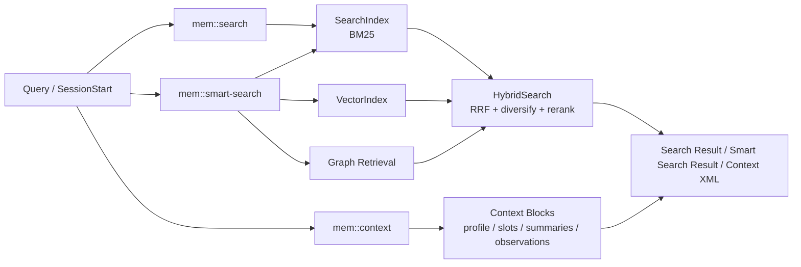
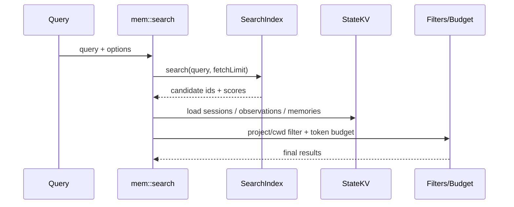

# agentmemory 检索层实现细节

本文是一份检索层参考文档，面向第一次接手 `agentmemory` 的开发者。

它重点回答下面几个问题：

1. 检索层在整个系统里负责什么。
2. `mem::search`、`mem::smart-search`、`mem::context` 分别解决什么问题。
3. BM25、向量检索和混合检索是如何组合工作的。
4. 索引是如何构建、恢复和在运行时兜底重建的。

本文聚焦 `4.4 检索层`，重点覆盖 `search/context` 主链路，不展开完整接口层和图谱实现的全部细节。

## 1. 检索层职责

检索层位于处理层之后、接口层之前。

如果说处理层解决的是“把 observation 变成可搜索结构”，那么检索层解决的就是：

- 如何从已有 observation 和 memory 中找到与当前问题最相关的内容。
- 如何在不同召回信号之间做组合，而不是只依赖单一路径。
- 如何在 token 预算内返回最有价值的结果，而不是简单返回最多结果。

因此，检索层的核心职责可以概括为三类：

- 提供基础搜索能力，例如 `mem::search`。
- 提供混合检索能力，例如 `mem::smart-search`。
- 提供上下文组装能力，例如 `mem::context`。

它不直接负责：

- hook 采集
- observation 压缩
- session summary 生成
- MCP / REST 的最终对外包装格式

它是整个系统从“已经被结构化的数据”走向“当前任务可用上下文”的那一层。

## 2. 总体结构

检索层可以理解为三条互相关联的路径：

- 关键词搜索路径：`SearchIndex -> mem::search`
- 混合检索路径：`HybridSearch -> mem::smart-search`
- 上下文组装路径：`profile / slots / summaries / observations -> mem::context`



这张图表达了几个关键点：

- `mem::search` 和 `mem::smart-search` 都是查询入口，但目标不同。
- `mem::context` 不做通用搜索，而是做上下文组装。
- 混合检索不是直接暴露一个底层类，而是由 `HybridSearch` 统一协调多路召回。

## 3. 关键入口

检索层相关的主要代码入口如下：

| 路径 | 角色 | 说明 |
| --- | --- | --- |
| `src/functions/search.ts` | 基础搜索入口 | 管理 BM25 索引、向量写入、`mem::search`、索引重建 |
| `src/functions/smart-search.ts` | 混合检索包装层 | 提供 `mem::smart-search` 的 compact / expanded 模式 |
| `src/functions/context.ts` | 上下文组装入口 | 把 profile、summary、observation 组织成预算内上下文 |
| `src/state/search-index.ts` | BM25 索引实现 | 关键词搜索基础能力 |
| `src/state/vector-index.ts` | 向量索引实现 | 语义搜索基础能力 |
| `src/state/hybrid-search.ts` | 混合检索协调器 | 融合 BM25、向量和图信号 |
| `src/state/index-persistence.ts` | 索引持久化 | 保存和恢复 BM25 / 向量索引 |
| `src/index.ts` | 运行时装配点 | 创建 `HybridSearch`、恢复索引、必要时重建 |

建议的阅读顺序是：

1. `search.ts`
2. `search-index.ts`
3. `vector-index.ts`
4. `hybrid-search.ts`
5. `smart-search.ts`
6. `context.ts`
7. `index.ts`

## 4. BM25 搜索路径：`mem::search`

### 4.1 `mem::search` 的定位

`mem::search` 是最基础的检索入口。

它解决的是：

- 给定一个查询词，如何从 observation 和 memory 中做关键词检索。
- 在需要时对结果做项目过滤、路径过滤和 token 预算裁剪。

它不是混合检索入口，也不会直接走图谱扩展和多信号融合。

### 4.2 输入参数

`mem::search` 主要接受这些参数：

- `query`
- `limit`
- `project`
- `cwd`
- `format`
- `token_budget`

其中：

- `format` 支持 `full`、`compact`、`narrative`
- `token_budget` 用于限制最终输出而不是底层检索本身

### 4.3 SearchIndex 的工作方式

`SearchIndex` 是一个内存中的 BM25 索引。

它内部维护了几类核心结构：

- `entries`：文档基础元信息
- `invertedIndex`：term 到 observation ID 的倒排表
- `docTermCounts`：每个文档内 term 频次
- `totalDocLength`：用于 BM25 长度归一化

当 `add(obs)` 被调用时，它会：

1. 从 observation 抽取文本字段
2. 分词
3. 统计 term frequency
4. 更新倒排索引和长度统计

### 4.4 分词与匹配特征

`SearchIndex` 的分词不仅仅是简单空格切分，还做了几件事：

- 对普通文本做 `stem`
- 对 term 做同义词扩展
- 对 CJK 文本做切分
- 支持 prefix matching

因此 BM25 路径并不只是“字面匹配”，而是一个带轻量增强的关键词搜索。

### 4.5 `mem::search` 的执行流程

`mem::search` 的主流程大致如下：



展开后可以分成这些阶段：

1. 校验并规范化输入。
2. 若索引为空，则调用 `rebuildIndex()`。
3. 用 BM25 索引执行搜索。
4. 若启用了 `project` 或 `cwd` 过滤，则先过 session 过滤。
5. 并行加载 observation。
6. 若 observation 不存在，则回退去 `KV.memories` 查找，再转换成 observation 视图。
7. 记录 access log。
8. 根据 `format` 和 `token_budget` 生成最终结果。

### 4.6 过滤与过量抓取

当启用 `project` 或 `cwd` 过滤时，`mem::search` 不会只取 `limit` 条候选，而是会先 over-fetch。

原因是：

- 过滤发生在索引查询之后
- 如果只抓 `limit` 条，过滤后可能几乎没有结果

所以它会放大抓取窗口，尽量让过滤后仍然能返回接近期望数量的结果。

### 4.7 结果格式

`mem::search` 提供三种输出格式：

- `full`
- `compact`
- `narrative`

其中：

- `compact` 更适合轻量列表展示
- `narrative` 额外生成一段文本摘要列表
- `full` 返回完整 `SearchResult`

`token_budget` 会在这些格式生成后统一裁剪，而不是影响底层 BM25 评分。

## 5. 向量与混合检索：`HybridSearch`

### 5.1 为什么需要混合检索

单纯 BM25 的问题是：

- 擅长精确关键词
- 不擅长语义接近但字面不同的查询

单纯向量检索的问题是：

- 语义强
- 对精确路径、文件名、术语、配置项不一定稳定

因此 `agentmemory` 采用混合检索，把多种信号放到同一个协调器里。

### 5.2 `HybridSearch` 的组成

`HybridSearch` 由以下部分构成：

- `SearchIndex`
- `VectorIndex`
- `EmbeddingProvider`
- `GraphRetrieval`

它还持有三组可配置权重：

- `bm25Weight`
- `vectorWeight`
- `graphWeight`

以及一个可选 rerank 开关。

### 5.3 向量检索路径

当存在：

- `vectorIndex`
- `embeddingProvider`
- 且向量索引非空

时，`HybridSearch` 会：

1. 为 query 生成 embedding
2. 在 `VectorIndex` 中做 cosine similarity 搜索

如果 embedding 生成失败，则会直接回退到非向量路径，不抛出致命错误。

### 5.4 图检索路径

`HybridSearch` 会先从 query 中抽实体：

- 若显式传入 `entityHints`，优先使用
- 否则调用 `extractEntitiesFromQuery(query)`

然后：

- 使用 `graphRetrieval.searchByEntities()` 获取图检索结果
- 再基于前几个向量命中做一轮图扩展

这说明图检索既可以来自 query 实体，也可以来自向量命中点的邻近扩展。

### 5.5 RRF 融合

`HybridSearch` 不直接把三个 score 生硬相加，而是按 rank 做 RRF 融合。

每一路结果会记录：

- rank
- 原始 score
- sessionId

然后通过加权的 `1 / (k + rank)` 组合成 `combinedScore`。

这样做的好处是：

- 不要求不同召回源的原始 score 落在同一量纲
- 更适合把“排位表现”稳定地融合在一起

### 5.6 动态权重归一化

如果某一路结果为空，例如：

- 没有向量索引
- 图检索失败

系统会把缺失路径的权重置零，再对剩余权重做归一化。

也就是说：

- 有三路时走三路融合
- 只有 BM25 时就退成 BM25-only
- 不会因为某一路缺失而拉低剩余路径的贡献

### 5.7 多样化与 rerank

`HybridSearch` 在融合后还会做两步后处理：

- `diversifyBySession()`：限制每个 session 最多入选一定数量结果，默认 3 条
- 可选 rerank：若 `RERANK_ENABLED=true`，对前一段窗口再次重排

session diversification 的目标是：

- 防止单个 session 占满前 N 条
- 让结果覆盖更宽的时间和上下文范围

## 6. `mem::smart-search`

### 6.1 定位

`mem::smart-search` 是 `HybridSearch` 的函数化包装。

它主要提供两种模式：

- compact search
- expanded fetch

### 6.2 compact 模式

当请求里提供 `query` 时，`mem::smart-search` 会：

1. 校验 query
2. 限制 `limit`
3. 调用传入的 `searchFn`，也就是 `HybridSearch.search()`
4. 返回 `CompactSearchResult[]`

这条路径的目标是：

- 快速返回轻量候选列表
- 让上层先看到标题、类型、时间戳和分数

### 6.3 expanded 模式

当请求里提供 `expandIds` 时，`mem::smart-search` 不再重新搜索，而是：

1. 根据 `obsId` 或 `{ obsId, sessionId }` 查 observation
2. 优先用 `sessionIdHint`
3. 若没找到，则遍历 session 分批查找
4. 返回完整 observation

这是一条典型的 progressive disclosure 路径：

- 第一步先拿 compact 列表
- 第二步按需展开具体 observation

### 6.4 与 `mem::search` 的区别

可以这样区分两者：

| 入口 | 主要目标 |
| --- | --- |
| `mem::search` | 基础 BM25 搜索，支持多种输出格式和 token budget |
| `mem::smart-search` | 混合检索的轻量包装，强调 compact + expanded 交互 |

它们都能检索 observation 和 memory，但定位不同。

## 7. `mem::context`：上下文组装路径

### 7.1 定位

`mem::context` 不是通用搜索接口，而是一个专门为“会话启动时要注入什么上下文”设计的函数。

它的输入只有：

- `sessionId`
- `project`
- 可选 `budget`

它的目标不是找出得分最高的 observation，而是生成一个适合直接注入 prompt 的上下文块。

### 7.2 数据来源

`mem::context` 会收集四类候选内容：

- pinned slots
- project profile
- session summaries
- 重要 observations

这条路径的特点是：

- 它高度依赖已有处理结果
- 它优先使用“更高层、更浓缩”的对象，例如 summary 和 profile

### 7.3 构造 block 的方式

它会把每一类内容都封装成 `ContextBlock`，包含：

- `type`
- `content`
- `tokens`
- `recency`
- 可选 `sourceIds`

随后所有 block 会按 `recency` 排序，而不是按搜索分数排序。

这说明 `mem::context` 的偏好是：

- 近期优先
- 高层摘要优先
- 预算内尽量装入更多高价值块

### 7.4 summary 优先与 observation 回退

对于最近 session：

- 若存在 `SessionSummary`，优先用 summary
- 若没有 summary，则退回去取该 session 下 `importance >= 5` 的 observation

这是一条很重要的回退策略：

- 有 summary 时用浓缩结果
- 没 summary 时仍可从 observation 中拼出最小上下文

### 7.5 token budget

`mem::context` 会：

1. 为每个 block 估算 token
2. 先计算 XML 头尾成本
3. 按排序后的 block 逐个尝试装入
4. 超预算就跳过后续 block

最终返回：

- `context`
- `blocks`
- `tokens`

其输出会被包装成：

```xml
<agentmemory-context project="...">
  ...
</agentmemory-context>
```

这说明 `mem::context` 的结果不是用于程序内继续处理，而是直接面向模型注入。

## 8. 索引构建、恢复与重建

### 8.1 为什么需要持久化

`SearchIndex` 和 `VectorIndex` 都是内存结构。

如果每次启动都从零构建，会带来几个问题：

- 启动慢
- 最近数据不可立即检索
- 大量 observation 会反复重建

因此系统通过 `IndexPersistence` 把 BM25 和向量索引序列化到状态存储。

### 8.2 `IndexPersistence`

`IndexPersistence` 提供三类能力：

- `scheduleSave()`
- `save()`
- `load()`

它的特点包括：

- 使用 debounce，避免频繁落盘
- 持久化 BM25 和向量索引
- 对失败日志做节流

### 8.3 启动恢复

在 `src/index.ts` 中，系统启动时会：

1. 创建 `IndexPersistence`
2. 调用 `load()`
3. 若存在持久化索引，则恢复到内存索引

对于向量索引，还会额外做维度校验：

- 如果磁盘上的向量维度与当前 provider 不匹配，则拒绝加载
- 若设置了 `AGENTMEMORY_DROP_STALE_INDEX=true`，则丢弃脏向量并等待后续重建

这一步是为了防止跨 provider 或错误维度导致语义检索静默失真。

### 8.4 `rebuildIndex()`

当 BM25 索引为空时，系统会调用 `rebuildIndex(kv)`。

它会：

1. 清空 BM25
2. 清空向量索引
3. 先遍历 `KV.memories`
4. 再遍历所有 session 下的 observations
5. 为每个 observation / memory 写入 BM25
6. 尝试为其生成向量写入

这说明检索层的索引对象覆盖两类数据：

- observation
- memory

### 8.5 运行时回填 memory

即使 BM25 已成功恢复，`src/index.ts` 仍会检查并回填 memory。

原因是旧版本里：

- `mem::remember` 写入了 `KV.memories`
- 但没有保证 memory 一定进入 BM25

所以启动时会额外扫描：

- 若 memory 不在 BM25 中，就补写进去

这是一个兼容旧数据的启动修复逻辑。

## 9. 边界条件与降级策略

检索层的核心原则是：

> 能多路召回时做多路召回，不能时退回最小可用路径。

下面是几个关键边界条件。

### 9.1 BM25-only 模式

如果没有 embedding provider 或向量索引为空：

- `mem::search` 仍可工作
- `HybridSearch` 会自然退成 BM25 + Graph 或纯 BM25

这保证了检索层的最小可用能力不依赖向量服务。

### 9.2 向量写入与查询软失败

无论是：

- 向量写入时 embedding 失败
- 查询时 query embedding 失败
- 向量维度不匹配

系统都不会让检索链路崩溃，而是退回剩余可用信号。

### 9.3 图检索 best-effort

图检索和图扩展均是 best-effort：

- 抽实体失败可忽略
- 图检索失败可忽略
- expansion 失败可忽略

因此 graph 只会增强结果，不会成为硬依赖。

### 9.4 过滤后结果不足

`mem::search` 在有 `project` / `cwd` 过滤时会 over-fetch，但仍有可能过滤后不足。

这种情况下系统不会强行补齐，而是返回真实可用结果。

### 9.5 token budget 是输出裁剪，不是检索裁剪

无论是 `mem::search` 还是 `mem::context`：

- token budget 控制的是最终返回结果的体积
- 不是底层候选召回数量

这可以避免预算过小导致底层搜索完全失真。

## 10. 一次完整检索示例

下面用两种典型请求说明检索层如何工作。

### 10.1 `mem::smart-search`

场景：

- 用户搜索“database performance optimization”

处理过程：

1. `mem::smart-search` 接收 query。
2. 它调用 `HybridSearch.search(query, limit)`。
3. `HybridSearch` 分别执行 BM25、向量检索和图检索。
4. 系统用 RRF 融合三路结果。
5. 对结果按 session 做多样化。
6. 可选地做 rerank。
7. 加载 observation 或 memory 回退视图。
8. 返回 compact 结果列表。

### 10.2 `mem::context`

场景：

- 新 session 启动，系统需要返回项目上下文。

处理过程：

1. `mem::context` 读取 pinned slots 和 project profile。
2. 它收集最近同项目的历史 session。
3. 对每个 session，优先读取 summary。
4. 若无 summary，则退回重要 observation。
5. 将这些内容封装为 `ContextBlock`。
6. 按 recency 排序。
7. 在 budget 内依次装入。
8. 输出 XML 上下文字符串。

这两个示例说明：

- `mem::smart-search` 偏“查结果”
- `mem::context` 偏“组上下文”

## 11. 扩展检索层时应关注什么

如果你要新增检索能力，建议优先判断它属于哪一类：

- 新的召回源
- 新的结果后处理
- 新的上下文组织策略

然后再检查下面几件事：

- 新召回源应接在 `HybridSearch` 里，还是只做单独函数。
- 失败时是否允许软失败。
- 新信号是按 rank 融合，还是按 score 直加。
- 是否需要 session diversification。
- 是否需要纳入 token budget 或上下文 block 模型。

对新增召回源，推荐顺序是：

1. 先明确候选数据来源
2. 再定义 score / rank 表达方式
3. 确认和现有 BM25、向量、图信号的融合方式
4. 最后再考虑如何暴露给 `mem::search`、`mem::smart-search` 或 `mem::context`

## 12. 关键代码导航

如果你要从代码继续往下追，建议按这个顺序阅读：

| 路径 | 阅读目的 |
| --- | --- |
| `src/functions/search.ts` | 理解基础搜索入口、索引重建和 memory 回退 |
| `src/state/search-index.ts` | 理解 BM25 索引内部结构与匹配逻辑 |
| `src/state/vector-index.ts` | 理解向量索引的存储与搜索方式 |
| `src/state/hybrid-search.ts` | 理解多路召回、RRF、session diversification 与 rerank |
| `src/functions/smart-search.ts` | 理解 compact / expanded 两种智能搜索模式 |
| `src/functions/context.ts` | 理解上下文块如何被组装与裁剪 |
| `src/state/index-persistence.ts` | 理解索引保存与恢复 |
| `src/index.ts` | 理解启动时如何恢复、校验和重建索引 |

## 13. 一句话总结

检索层的本质可以概括为：

> 从 observation、memory、summary 和 profile 这些已处理数据里，选出当前任务最值得拿回来的那一小部分。

如果你已经理解这份文档，下一步最自然的延伸就是阅读：

- `docs/processing-layer-reference.md`
- `docs/collection-layer-reference.md`
- 记忆层与状态模型实现细节
